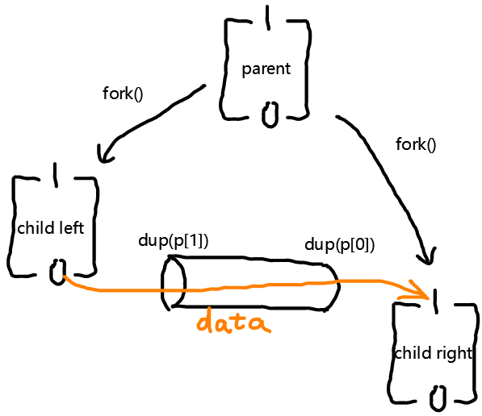

# Homework: shell
该作业的任务是让我们实现shell的几个特性，以熟悉Unix系统调用接口。
## 涉及知识点
### 文件描述符
>A file descriptor is a small integer representing a kernel-managed object that a process may read from or write to

文件描述符是一个整数，它表示一个由内核管理的对象，进程可以从这个对象中读取或写入数据

>a process reads from file descriptor 0 (standard input), writes output to file descriptor 1 (standard output), and writes error messages to file descriptor 2 (standard error). 

一个进程通常有三个文件描述符：
* 0 (standard input),
* 1 (standard output)
* 2 (standard error).

### execv函数
int execv(const char *path, char *const argv[]);
path传入的是命令所在位置，argv是是一个NULL为结尾的字符串，argv[0]为文件名，其他为参数。

### open函数
函数：
int open(const char *pathname, int flags);
int open(const char *pathname, int flags, mode_t mode);

参数：
1. `flags`: O_RDONLY,  O_WRONLY,  or  O_RDWR，分别表示只读、只写、可读写。
2. `mode`:
S_IRUSR  00400 user has read permission，用户可读
S_IWUSR  00200 user has write permission，用户可写

### dup函数
函数：int dup(int oldfd);
解释：dup创建了oldfd 的副本。返回值为新的文件描述符，值为未使用的文件描述符中的最小值。


## execcmd---'　' 的实现
**1. 需要注意的点：**
该函数内需要加入`ls`、`cat`、`wc`之类的系统命令的文件路径，因为该`sh.c`并没有实现这些功能。
记得把当前路径也加进去，才能在需要程序本身执行读写操作的时候能够找到程序路径，如 `./a.out < t.sh` 。
```c
struct cmd {
  int type;          //  ' ' (exec), | (pipe), '<' or '>' for redirection
};

struct execcmd {
  int type;              // ' '
  char *argv[MAXARGS];   // arguments to the command to be exec-ed
};
```
```c
/*
    execcmd：执行普通命令
    newpath：设置命令所在目录。ls位于/bin/，sort、uniq、wc位于/usr/bin/，a.out位于./。
*/
  case ' ':
    ecmd = (struct execcmd*)cmd;
    if(ecmd->argv[0] == 0)
      _exit(0);
    //fprintf(stderr, "exec not implemented\n");
    // Your code here ...

    char newpath[MAXARGS]="/bin/";
    strcat(newpath, ecmd->argv[0]);
    if(execv(newpath,ecmd->argv) == -1){
        strcpy(newpath,"/usr/bin/");
        strcat(newpath,ecmd->argv[0]);
        if(execv(newpath,ecmd->argv) == -1){
            strcpy(newpath,"./");
            strcat(newpath,ecmd->argv[0]);
            if(execv(newpath,ecmd->argv) == -1){
                fprintf(stderr, "Command %s can't find.\n",ecmd->argv[0]);
            }
        }
    }
    break;
```

## redircmd---'<' or '>'的实现
>The close system call releases a file descriptor, making it free for reuse by a fu-
ture open, pipe, or dup system call (see below). A newly allocated file descriptor is al-
ways the lowest-numbered unused descriptor of the current process.

**注意点**：`close()`函数是把 fd 释放以便其他函数`open`、`pipe`或`dup`这些系统调用可以使用，而不是关闭了就不能用了。
如指令 `cat < z.txt`重定向时需要`close(rcmd->fd);` ，关闭标准输入fd `0`后，open使用该fd `0`打开文件，`cat`使用这个指向z.txt文件的fd `0`来读取文件。

```c
struct redircmd {
  int type;          // < or >
  struct cmd *cmd;   // the command to be run (e.g., an execcmd)
  char *file;        // the input/output file
  int flags;         // flags for open() indicating read or write
  int fd;            // the file descriptor number to use for the file
};
```
```c
  case '>':
  case '<':
    rcmd = (struct redircmd*)cmd;
    //fprintf(stderr, "redir not implemented\n");
    // Your code here ...
    close(rcmd->fd); //关闭标准输入：0或输出：1，以便open函数能够读取或写入文件。不关闭的话open读不到文件。
    if(open(rcmd->file, rcmd->flags, S_IRUSR|S_IWUSR) < 0) //user has read and write  permission,如果不设置权限，文件除了root没人能访问。
    {
        fprintf(stderr, "Try to open :%s failed\n", rcmd->file);
        _exit(0);
    }
    runcmd(rcmd->cmd);
    break;
```
## pipeline---' | '的实现

[相关视频资料](https://www.youtube.com/watch?v=yQLd2iJ9Oa0)

**管道的数据流动**：
如代码所示，左子进程在数据通信时只剩下 fd `0`和 `dup(p[1])`；右子进程只剩下 fd `1`和`dup(p[0])`。数据流动方向如下图所示。



**疑问**：为什么子进程和父进程总共关闭了三次管道？

我的理解是虽然使用的是同一个管道，但各个进程close()管道是对于它自己而言的，相当于说每个进程有记录自己现在有哪些 fd 可以用，如果用不到，就释放掉，其他系统调用可以拿去用。即使在自己进程中close()了p[0]，其他拥有这个p[0]的进程依然能正常地使用管道。而大家按需使用完管道后需要把自己记录的管道 fd 从记录中删除。

```c
struct pipecmd {
  int type;          // |
  struct cmd *left;  // left side of pipe
  struct cmd *right; // right side of pipe
};

```
```c
    case '|':
    pcmd = (struct pipecmd*)cmd;
    //fprintf(stderr, "pipe not implemented\n");
    // Your code here ...
    if(pipe(p)<0)
        fprintf(stderr,"create pipe failed");
    if(fork()==0){
        close(1);
        dup(p[1]);
        close(p[0]);
        close(p[1]);
        runcmd(pcmd->left);
    }
    if(fork()==0){
        close(0);
        dup(p[0]);
        close(p[0]);
        close(p[1]);
        runcmd(pcmd->right);
    }
    close(p[0]);
    close(p[1]);
    wait(&r);
    wait(&r);
    break;
```

## 遇到的问题
1. sh.c文件一定要在6.828文件夹里面跑，否则会出奇怪的问题
2. 实现execcmd的时候，需设定命令所在路径，不止需要bin路径，还需要当前路径，否则执行a.out会找不到程序。
3. 在实现redircmd重定向命令的时候，open文件需要指定mode，否则创建的文件没有权限访问。
## 未解决的问题
1. main函数里的wait(&r)中的r为什么没初始化就能用？

