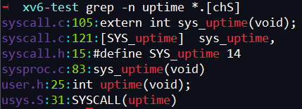
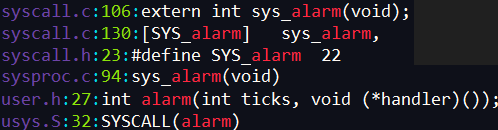
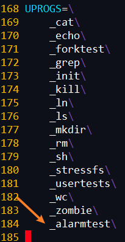
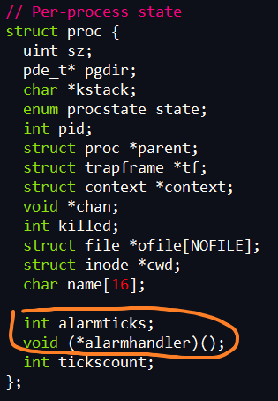
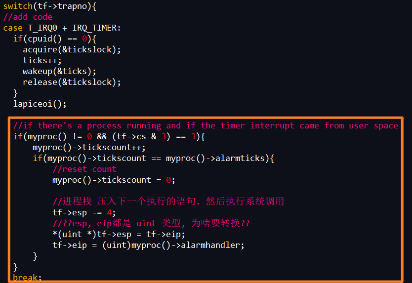
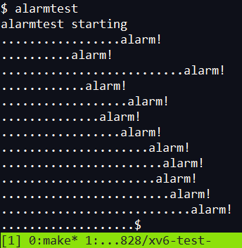

# 目录
<!-- vim-markdown-toc GFM -->

* [Homework: xv6 CPU alarm](#homework-xv6-cpu-alarm)
    * [疑问](#疑问)

<!-- vim-markdown-toc -->

# Homework: xv6 CPU alarm

该练习为xv6添加一个特性，会在进程使用CPU时间时定期发出警报.  

我们要添加一个alarm(interval, handler)系统调用, 在interval个CPU时间后, 运行handler函数.

和前面的homework syscall 一样, 照着文件修改:



修改的主要内容:  
```c
syscall.c 系统调用函数声明
syscall.h 定义系统调用函数号
sysproc.c 添加系统调用函数的实现
user.h 用户态函数定义
user.S 用户态函数实现
```


1. 添加的代码如下. 其中`user.h`中的函数定义需要注意,不要忘记写参数:  



2. 添加alarmtest.c文件
```c
#include "types.h"
#include "stat.h"
#include "user.h"

void periodic();

int
main(int argc, char *argv[])
{
  int i;
  printf(1, "alarmtest starting\n");
  alarm(10, periodic);
  for(i = 0; i < 25*500000; i++){
    if((i % 250000) == 0)
      write(2, ".", 1);
  }
  exit();
}

void
periodic()
{
  printf(1, "alarm!\n");
}
```

3. Makefile中加入源文件名



4. > Hint: Your sys_alarm() should store the alarm interval and the pointer to the handler function in new fields in the proc structure; see proc.h.

在`proc.h`的`strucct proc`中加入alarm interval 和 handler pointer. 为了计算距离上次调用函数经过了多少ticks, 还要加一个`int tickcount`.




5. > Hint: here's a sys_alarm() for free: 

把sys_alarm()的实现写入syscall.c


6. > Hint: Every tick, the hardware clock forces an interrupt, which is handled in trap() by case T_IRQ0 + IRQ_TIMER; you should add some code here.

在`trap.c`的 `case T_IRQ0 + IRQ_TIMER`条件中加入如下代码:  
先每次计数加一, 到达指定tick数后执行函数.  
执行前将下一个要执行的语句压栈, 然后执行handler函数.



**实验结果:**  

若只有一两个alarm, 可以把alarmtest.c里的循环范围x5  



## 疑问
trap.c 中的*(uint *)tf->esp = tf->eip;为什么要转换. 不都是uint型吗
