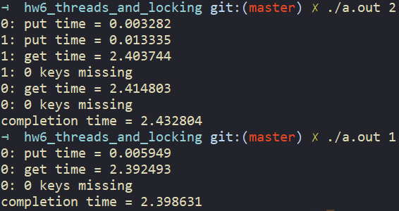

# Homework: Threads and Locking

该实验让我们用锁和线程机制来进行并行编程。该实验要真机环境，需要多核的支持。我在vmware中设置了处理器数量和核心数量来实现该目的。


下载`ph.c`后执行：  
```bash
$ gcc -g -O2 ph.c -pthread
$ ./a.out 2
```

能看出两线程执行时间比单进程执行时间稍长，但是执行了两倍的工作。 然而其中有两万条key没有插入到hash table中。


> Q1: Why are there missing keys with 2 or more threads, but not with 1 thread? Identify a sequence of events that can lead to keys missing for 2 threads.

因为两个线程的时候，插入哈希表时的cpu轮转导致节点出现偏差。  
HashTable的`NBUCKET`为5，插入10000个随机数，正常来说该哈希表的每个key都会有对应value。  
当核心数为1时，程序先把所有key、value都放进HashTable，然后读出key value，不会出什么问题。
但当核心数为2时。两个核心各自put一半的keys[], 意外的情况为：当thread 2执行到`insert`函数，还未执行`e->next = n;`进行链接时，轮转到thread 1，当它执行完insert函数，且正好插入的entry和thread 1在同一个bucket后， thread 2 的entry *n按道理应该为thread 1刚插入的entry，但是它保存的是旧值，所以thread 1的entry就没链接上了。  


> Q2: Test your code first with 1 thread, then test it with 2 threads. Is it correct (i.e. have you eliminated missing keys?)? Is the two-threaded version faster than the single-threaded version?

要想避免错误，insert函数就不能被中断。  我们对`put()`和`get()`都加上锁：  

```c
static
void put(int key, int value)
{
  int i = key % NBUCKET;
  pthread_mutex_lock(&lock);
  //第一个table[i]用于修改key为i的链表头，第二个table[i]是key为i的链表头节点
  insert(key, value, &table[i], table[i]);
  pthread_mutex_unlock(&lock);
}

static struct entry*
get(int key)
{
  struct entry *e = 0;

  int i = key % NBUCKET;

  pthread_mutex_lock(&lock);
  for (e = table[key % NBUCKET]; e != 0; e = e->next) {
    if (e->key == key) break;
  }
  pthread_mutex_unlock(&lock);

  return e;
} 
```

再次运行，能看到两个线程的速度明显低于一个线程，说明有临界区时，多线程效率不一定高。 加锁后的程序运行正常，0 miss。  
   

若get()不上锁，速度很快，且没有出现错误。因为get()只是读取节点：  
  

```c
static
void put(int key, int value)
{
  int i = key % NBUCKET;
  pthread_mutex_lock(&lock);
  //第一个table[i]用于修改key为i的链表头，第二个table[i]是key为i的链表头节点
  insert(key, value, &table[i], table[i]);
  pthread_mutex_unlock(&lock);
}

static struct entry*
get(int key)
{
  struct entry *e = 0;
  int i = key % NBUCKET;
  for (e = table[key % NBUCKET]; e != 0; e = e->next) {
    if (e->key == key) break;
  }
  return e;
} 
```

## 问题
1. 问题pthread_join的作用是不是等待线程执行完？
2. 为什么key要为线程数的整数倍？
3. get为什么不用加锁？难道不会出现get到还未插入的节点的情况？

