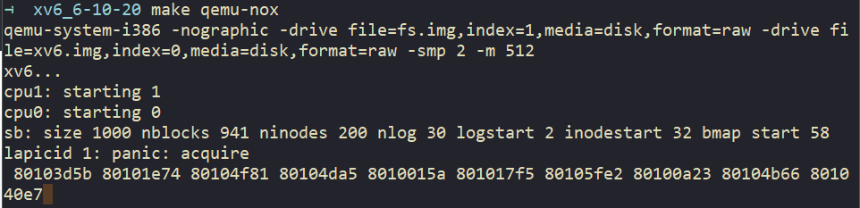

# Homework: xv6 locking

## Don't do this

```c
  struct spinlock lk;
  initlock(&lk, "test lock");
  acquire(&lk);
  acquire(&lk);
```

> **Submit**: Explain in one sentence what happens.  

第一个acquire获取锁，但是没释放，第二个acquire就卡住了，acquire内有个语句判断是否已经acquire当前锁：  `if(holding(lk)) panic("acquire");`，所以此时会输出acquire。

## Interrupts in ide.c

`acquire()`内用`cli`指令确保中断机制已关闭，直到执行release，用sti重新开启中断机制。关闭中断是为了防止中断后执行的处理函数中中需要用到某个锁，而在中断前，这个锁已经被获取了，导致进入的中断处理函数没法继续运行，造成死锁。  

现在在acquire()后加上sti()，在release()前加cli()，重新构建内核。

执行十七八次后，出现panic：  


> **Submit**: Explain in a few sentences why the kernel panicked. You may find it useful to look up the stack trace (the sequence of `%eip` values printed by `panic`) in the `kernel.asm` listing.  

通过查找`kernel.asm`中的语句，没看出是什么原因导致panic。可能是因为加上`sti()`后，某次中断处理时再一次执行了acquire，导致panic。

```as
80103d5b:    panic("acquire"); -->acquire()
80101e74:  if((b = idequeue) == 0){  -->void ideintr(void)
80104f81:    lapiceoi(); -->static inline uint rcr2(void)
80104da5:  addl $4, %esp -->alltraps:
8010015a: return b; -->bread(uint dev, uint blockno)
801017f5:    bp = bread(ip->dev, bmap(ip, off/BSIZE)); -->int readi(struct inode *ip, char *dst, uint off, uint n)
80105fe2: ...
80100a23:
80104b66:
801040e7:
```

## Interrupts in file.c  

恢复前面的代码，对file.c像上面一样加上cli()和sti()。

> **Submit**: Explain in a few sentences why the kernel didn't panic. Why do file_table_lock and ide_lock have different behavior in this respect?  
you may find it helpful to look at which functions acquire each lock, and then at when those functions get called.

因为`file_table_lock`是在文件打开或关闭的时候加锁，而每次打开文件，读写数据的时间一般都比较长，所以不容易发生两个线程进同一临界区的情况。或者是中断处理程序内并没有代码对`ftable.lock`加锁，自然也就没有影响。

## xv6 lock implementation

> Submit: Why does release() clear lk->pcs[0] and lk->cpu before clearing lk->locked? Why not wait until after?

因为若当前有其他进程正在等待该锁，若先清除锁的状态，其他进程立马获取，就可能会出现初始化的 lk->pcs[0] 和 lk->cpu 为新进程的状态，导致错误。
