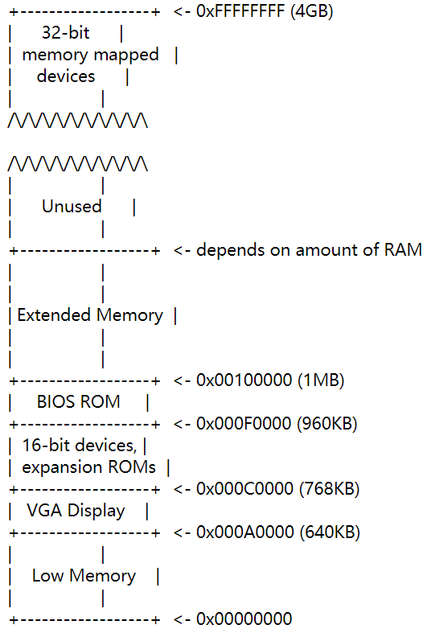

## Part 1: PC Bootstrap
## menu

<!-- vim-markdown-toc GFM -->

    * [Exercise 1.](#exercise-1)
    * [Exercise 2.](#exercise-2)
* [Part 2: The Boot Loader](#part-2-the-boot-loader)
    * [Loading the Kernel](#loading-the-kernel)
    * [Exercise 3.](#exercise-3)
    * [Exercise 5](#exercise-5)
    * [Exercise 6](#exercise-6)
    * [Exercise 7](#exercise-7)
    * [Exercise 8](#exercise-8)
    * [The Stack](#the-stack)
    * [Exercise 9](#exercise-9)
    * [Exercise 10.](#exercise-10)
    * [Exercise 12](#exercise-12)
    * [一些疑问](#一些疑问)

<!-- vim-markdown-toc -->

### Exercise 1. 
>Q:Familiarize yourself with the assembly language materials available on  [the 6.828 reference page](https://pdos.csail.mit.edu/6.828/2018/reference.html). You don't have to read them now, but you'll almost certainly want to refer to some of this material when reading and writing x86 assembly.

### Exercise 2.
>Use GDB's si (Step Instruction) command to trace into the ROM BIOS for a few more instructions, and try to guess what it might be doing. You might want to look at [Phil Storrs I/O Ports Description](http://web.archive.org/web/20040404164813/members.iweb.net.au/~pstorr/pcbook/book2/book2.htm), as well as other materials on the [6.828 reference materials page](https://pdos.csail.mit.edu/6.828/2018/reference.html). No need to figure out all the details - just the general idea of what the BIOS is doing first.

如下图所示，0x000A0000 (640KB)-0x00100000 (1MB)都是给硬件用的，Basic Input/Output System (BIOS)位于0x000F0000 (960KB)-0x00100000 (1MB)



通过gdb内的第一条输出`[f000:fff0] 0xffff0:	ljmp   $0xf000,$0xe05b`知道BIOS是从内存的`0xffff0`开始执行，`ljmp`往回跳是因为从`0xffff0`到`0xfffff`只有16bytes了，这么小的空间内做不了什么事情，所以往回跳转，扩大空间来执行BIOS。
在初始化PCI bus和VGA显示设备和一些其他设备后，寻找可用于启动的硬盘或软盘，读取boot loader并转交以控制权。
如下语句详细解释了BIOS是如何找硬盘的：
>if the disk is bootable, the first sector is called the _boot sector_, since this is where the boot loader code resides. When the BIOS finds a bootable floppy or hard disk, it loads the 512-byte boot sector into memory at physical addresses 0x7c00 through 0x7dff, and then uses a jmp instruction to set the CS:IP to 0000:7c00, passing control to the boot loader

找到可启动的硬盘->找到第一个分区（boot sector---大小512-byte）->加载该分区到内存的`0x7c00---0x7dff`的地址中->跳转到`0000:7c00`(即0x7c00)，完成控制权的转交


## Part 2: The Boot Loader
### Loading the Kernel
	

### Exercise 3.
>Q: At what point does the processor start executing 32-bit code? What exactly causes the switch from 16- to 32-bit mode?

该语句`55   ljmp    $PROT_MODE_CSEG, $protcseg`实现从16位模式到32位模式的切换。位于文件`lab/boot/boot.S`:

```as
 48   lgdt    gdtdesc
 49   movl    %cr0, %eax
 50   orl     $CR0_PE_ON, %eax
 51   movl    %eax, %cr0
 52
 53   # Jump to next instruction, but in 32-bit code segment.
 54   # Switches processor into 32-bit mode.
 55   ljmp    $PROT_MODE_CSEG, $protcseg
```
>Q: What is the  _last_  instruction of the boot loader executed, 

boot loader最后执行的语句位于`lab/boot/main.c`第`60`行：

```as
 58     // call the entry point from the ELF header
 59     // note: does not return!
 60     ((void (*)(void)) (ELFHDR->e_entry))();
```
或者位于`lab/obj/boot/boot.asm`第`306`行：
```as
    305         ((void (*)(void)) (ELFHDR->e_entry))();
    306     7d6b:       ff 15 18 00 01 00       call   *0x10018
```
> Q:  and what is the  _first_  instruction of the kernel it just loaded?
位于`lab/obj/kern/kernel.asm`第`20`行，
```as
     19 f010000c <entry>:
     20 f010000c:       66 c7 05 72 04 00 00    movw   $0x1234,0x472
```


>Q:  _Where_  is the first instruction of the kernel?

答：`0x0010000c`
在文件`lab/obj/boot/boot.asm`中，可以看到bootloader到`306`行就进行内存跳转，跳转到`0x10018`执行语句，也就是进入kernel的语句

```as
305     ((void (*)(void)) (ELFHDR->e_entry))();
306     7d6b:   ff 15 18 00 01 00       call   *0x10018
```

通过gdb进行调试：在lab文件夹中`make qemu-nox-gdb`，然后开启另一个终端在lab中`make gdb`。如下所示，设置断点->跑到断点处->进入kernel，跑的第一个语句位于`0x0010000c`。后通过`x/x 0x10018`也可看到`0x10018`内存的值的确是地址`0x0010000c`

```
(gdb) b *0x7d6b
Breakpoint 1 at 0x7d6b
(gdb) c
Continuing.
The target architecture is assumed to be i386
=> 0x7d6b:      call   *0x10018

Breakpoint 1, 0x00007d6b in ?? ()
(gdb) si
=> 0x10000c:    movw   $0x1234,0x472
0x0010000c in ?? ()
(gdb) x/x 0x10018
0x10018:        0x0010000c
```

>Q:  How does the boot loader decide how many sectors it must read in order to fetch the entire kernel from disk? Where does it find this information?

boot loader 读取`ELF header`中的长度，通过for循环读取。

```c
     50     // load each program segment (ignores ph flags)
     51     ph = (struct Proghdr *) ((uint8_t *) ELFHDR + ELFHDR->e_phoff);
     52     eph = ph + ELFHDR->e_phnum;
     53     for (; ph < eph; ph++)
     54         // p_pa is the load address of this segment (as well
     55         // as the physical address)
     56         readseg(ph->p_pa, ph->p_memsz, ph->p_offset);
```


### Exercise 5
>Trace through the first few instructions of the boot loader again and identify the first instruction that would "break" or otherwise do the wrong thing if you were to get the boot loader's link address wrong. Then change the link address in boot/Makefrag to something wrong, run make clean, recompile the lab with make, and trace into the boot loader again to see what happens. Don't forget to change the link address back and make clean again afterward!
修改`lab/boot/Makefrag`中` 28     $(V)$(LD) $(LDFLAGS) -N -e start -Ttext 0x7e00 -o $@.out $^`的链接地址选项`Ttext`，原来是`0x7c00`，现修改为`0x7e00`。因为BIOS将boot loader加载到了内存的`0x7c00`,所以我们依旧在`0x7c00`设置断点。
```as
(gdb) b *0x7c00
Breakpoint 1 at 0x7c00
(gdb) c
Continuing.
[   0:7c00] => 0x7c00:  cli
```
前面的语句都正常，直到该语句出现。这条指令是把指令后面的值`0x7e64`所指定内存地址处后6个字节的值输入全局描述符表寄存器GDTR，但是检查后发现全部是0，导致实模式到保护模式失败。
`[   0:7c1e] => 0x7c1e:  lgdtw  0x7e64`
```as
(gdb) x/6x 0x7e64
0x7e64: 0x00000000      0x00000000      0x00000000      0x00000000
0x7e74: 0x00000000      0x00000000
```
执行到如下语句时就不停地循环，不知道为啥

```as
(gdb) si
[   0:7c2d] => 0x7c2d:  ljmp   $0x8,$0x7e32
0x00007c2d in ?? ()
(gdb) si
[   0:7c2d] => 0x7c2d:  ljmp   $0x8,$0x7e32
0x00007c2d in ?? ()
```
### Exercise 6
>Q: Examine the 8 words of memory at 0x00100000 at the point the BIOS enters the boot loader

值都为0

>Q: and then again at the point the boot loader enters the kernel

当boot loader进入kernel，`0x00100000`不为0，说明内核已经加载
```as
(gdb) x/8x 0x00100000
0x100000:       0x1badb002      0x00000000      0xe4524ffe      0x7205c766
0x100010:       0x34000004      0x2000b812      0x220f0011      0xc0200fd8
```

文件`lab/obj/kern/kernel.asm`:
```as
  14 f0100000:   02 b0 ad 1b 00 00       add    0x1bad(%eax),%dh
  15 f0100006:   00 00                   add    %al,(%eax)
  16 f0100008:   fe 4f 52                decb   0x52(%edi)
  17 f010000b:   e4                      .byte 0xe4
```
发现上面的内容与下面的`0x100000`地址处指令一样，说明此时已经进入kernel
```as
(gdb) x/8i 0x00100000
   0x100000:    add    0x1bad(%eax),%dh
   0x100006:    add    %al,(%eax)
   0x100008:    decb   0x52(%edi)
   0x10000b:    in     $0x66,%al
   0x10000d:    movl   $0xb81234,0x472
   0x100017:    and    %dl,(%ecx)
   0x100019:    add    %cl,(%edi)
   0x10001b:    and    %al,%bl
```

### Exercise 7

>Use QEMU and GDB to trace into the JOS kernel and stop at the `movl %eax, %cr0`. Examine memory at 0x00100000 and at 0xf0100000. Now, single step over that instruction using the stepi GDB command. Again, examine memory at 0x00100000 and at 0xf0100000. Make sure you understand what just happened.

在分页机制启动前，boot loader把内核加载到`0x00100000`,执行语句`mov    %eax,%cr0`后，内核开启分页机制，将kernel映射到`0xf0100000`高地址处。下图可以看到`0x00100000` `0xf0100000`处内存在语句执行前后的变化。语句执行后高地址处也加载了内核。
```as
(gdb)
=> 0x100025:    mov    %eax,%cr0
(gdb) x/8x 0x00100000
0x100000:       0x1badb002      0x00000000      0xe4524ffe      0x7205c766
0x100010:       0x34000004      0x2000b812      0x220f0011      0xc0200fd8
(gdb) x/8x 0xf0100000
0xf0100000 <_start+4026531828>: 0x00000000      0x00000000      0x00000000      0x00000000
0xf0100010 <entry+4>:   0x00000000      0x00000000      0x00000000      0x00000000
(gdb) si
=> 0x100028:    mov    $0xf010002f,%eax
0x00100028 in ?? ()
(gdb) x/8x 0x00100000
0x100000:       0x1badb002      0x00000000      0xe4524ffe      0x7205c766
0x100010:       0x34000004      0x2000b812      0x220f0011      0xc0200fd8
(gdb) x/8x 0xf0100000
0xf0100000 <_start+4026531828>: 0x1badb002      0x00000000      0xe4524ffe      0x7205c766
0xf0100010 <entry+4>:   0x34000004      0x2000b812      0x220f0011      0xc0200fd8
```
### Exercise 8
> Q:We have omitted a small fragment of code - the code necessary to print octal numbers using patterns of the form "%o". Find and fill in this code fragment.

在文件`lib/printfmt.c`中，仿照无符号整型修改。运行`make qemu`可看到八进制结果:
`qemu-system-i386 -nographic -drive file=obj/kern/kernel.img,index=0,media=disk,format=raw -serial mon:stdio -gdb tcp::26000 -D qemu.log 6828 decimal is 15254 octal!`
```c
200         // unsigned decimal
201         case 'u':
202             num = getuint(&ap, lflag);
203             base = 10;
204             goto number;
205
206         // (unsigned) octal
207         case 'o':
208             // Replace this with your code.
209             num = getuint(&ap,lflag);
210             base = 8;
211             goto number;
212 //          putch('X', putdat);
213 //          putch('X', putdat);
214 //          putch('X', putdat);
215 //          break;
```


>Q: 1.  Explain the interface between  printf.c  and  console.c. Specifically, what function does  console.c  export? How is this function used by  printf.c?

如下所示，`printf.c`中`vprintfmt()`函数把`console.c`中的`putch()`作为形参传入了`vprintfmt()`中。
	
* cprintf()---`kern/printf.c`
	* vprintf()
		*  vprintfmt((void*)putch, &cnt, fmt, ap); ---`lib/printfmt.c`
			* putch()
				* cputchar()---`kern/console.c`

>Q: 2.  Explain the following from  console.c:

`kern/console.h:#define CRT_SIZE       (CRT_ROWS * CRT_COLS)`中看到`CRT_SIZE`定义为行列乘积，表示显示屏的行数和列数，代码实现的功能为：若屏幕文本满了，将当前文本全部上移一行
```c    
    1      if (crt_pos >= CRT_SIZE) {
    2              int i;
    3              memmove(crt_buf, crt_buf + CRT_COLS, (CRT_SIZE - CRT_COLS) * sizeof(uint16_t));
    4              for (i = CRT_SIZE - CRT_COLS; i < CRT_SIZE; i++)
    5                      crt_buf[i] = 0x0700 | ' ';
    6              crt_pos -= CRT_COLS;
    7      }
```
	
	
>Q: 3.  For the following questions you might wish to consult the notes for Lecture 2. These notes cover GCC's calling convention on the x86.

```c    
    int x = 1, y = 3, z = 4;
    cprintf("x %d, y %x, z %d\n", x, y, z);
```    

在`lab`文件夹中执行` grep -E -r  'cprintf\('  .| grep -E '*\.c'`，搜索用到`cprintf`函数的`.c`文件，这里我们选择`monitor.c`来修改并调试代码。用`git diff monitor.c`查看文件变化情况，把上面代码加入了文件中。
```c
@@ -114,7 +114,9 @@ monitor(struct Trapframe *tf)

        cprintf("Welcome to the JOS kernel monitor!\n");
        cprintf("Type 'help' for a list of commands.\n");
+   	int x = 1, y = 3, z = 4;
+  		cprintf("x %d, y %x, z %d\n", x, y, z);

        while (1) {
                buf = readline("K> ");

```
在`kern/monitor.c:119`处设断点，看看`119     cprintf("x %d, y %x, z %d\n", x, y, z);`
后面会发生什么。
```
(gdb) b kern/monitor.c:119
Breakpoint 1 at 0xf0100783: file kern/monitor.c, line 119.
(gdb) c
Continuing.
The target architecture is assumed to be i386
=> 0xf0100783 <monitor+33>:     movl   $0x4,0xc(%esp)
```
		
>Q: 3.1 In the call to  `cprintf()`, to what does  `fmt`  point? To what does  `ap`  point?

`fmt` 存的是格式类型，`ap`中存放的是具体数据
不断执行si，直到发现`fmt=0xf0101abe` , `ap=0xf0116f74`
```
=> 0xf01008cf <vcprintf>:       push   %ebp
vcprintf (fmt=0xf0101abe "x %d, y %x, z %d\n", ap=0xf0116f74 "\001") at kern/printf.c:18
```
现在检查`fmt`，`ap`指向的内存，执行`x/s 0xf0101abe`，看到`fmt`里面的值是字符串`"x %d, y %x, z %d\n"`
```
(gdb) x/s 0xf0101abe
0xf0101abe:     "x %d, y %x, z %d\n"
```
执行`x/4w 0xf0116f74`，看到`ap`里面的数据是`x, y, z`的值`1, 3, 4`。
```
(gdb) x/4w 0xf0116f74
0xf0116f74:     0x00000001      0x00000003      0x00000004      0xf01017bc
```


>Q: 3.2   List (in order of execution) each call to  `cons_putc`,  `va_arg`, and  `vcprintf`. For  `cons_putc`, list its argument as well. For  `va_arg`, list what  `ap`  points to before and after the call. For  `vcprintf`  list the values of its two arguments.

>Q: 3.2.1 For  `vcprintf`  list the values of its two arguments.

在`kern/monitor.c:119`即`cprintf`函数所在行设置断点，一步一步`si`，可以看到函数参数如下

```c
cprintf (fmt=0xf0101abe "x %d, y %x, z %d\n") at kern/printf.c:27
vcprintf (fmt=0xf0101abe "x %d, y %x, z %d\n", ap=0xf0116f74 "\001") at kern/printf.c:18
```

>Q: 3.2.2 For  `cons_putc`, list its argument as well

若想查看`cputchar`的参数c的变化，要先跑到`monitor.c`中刚添加的`cprintf`函数中，我这里是119行。进入以后跑到`console.c`的`cons_putc(int c)`函数中，设置watch point，不断地continue就能获得每趟的值，将结果对照ascii表可以得到对应的字符串`"x 1, y 3, z 4\nK>"`。以下是gdb代码和每趟`cputchar`的参数值
```
make gdb
b kern/monitor.c:119
c
b kern/console.c:457
c
set logging overwrite on
set logging on 
watch c
c
c
```
```
putch (ch=120, cnt=0xf0116f3c) at kern/printf.c:14  //'x'
Breakpoint 2, cputchar (c=32) at kern/console.c:458 //' '
Breakpoint 2, cputchar (c=49) at kern/console.c:458 // 1
Breakpoint 2, cputchar (c=44) at kern/console.c:458 //','
Breakpoint 2, cputchar (c=32) at kern/console.c:458 //
Breakpoint 2, cputchar (c=121) at kern/console.c:458 // 'y'
Breakpoint 2, cputchar (c=32) at kern/console.c:458
Breakpoint 2, cputchar (c=51) at kern/console.c:458 // 3
Breakpoint 2, cputchar (c=44) at kern/console.c:458
Breakpoint 2, cputchar (c=32) at kern/console.c:458
Breakpoint 2, cputchar (c=122) at kern/console.c:458 //'z'
Breakpoint 2, cputchar (c=32) at kern/console.c:458 
Breakpoint 2, cputchar (c=52) at kern/console.c:458 // 4
Breakpoint 2, cputchar (c=10) at kern/console.c:458 //LF line feed, new line
Breakpoint 2, cputchar (c=75) at kern/console.c:458 //'K'
Breakpoint 2, cputchar (c=62) at kern/console.c:458 //'>'
Breakpoint 2, cputchar (c=32) at kern/console.c:458 //
```
>Q: 3.2.3 For  `va_arg`, list what  `ap`  points to before and after the call

`va_arg`函数位于`lib/printfmt.c的vprintfmt->getint->va_arg`中,`ap`指向的是值为`1, 3, 4`的`va_list *`类型，在压栈的时候按`4, 3, 1`的顺序压，出栈时按`1, 3, 4`顺序弹出。
**栈的情况如下：**
```
high    +-------------+
 ||     | arg3=4      |
 ||     | arg2=3      |
 ||     | arg1=1      |
 ||     | return addr |
 \/     | old %ebp    |<--%esp,%ebp
low     +-------------+ 
```
`ap`在取了当前值以后，`va_arg(*ap, int)`中的`ap`指针会按照`int`大小往`va_list`后面移动，所以会有`ap`的值在按照`1, 3, 4`的顺序变化。调用前后`ap`值如下：

```c
Hardware watchpoint 3: ap
Old value = (va_list) 0xf0116f74 "\001"
New value = (va_list) 0xf0116f78 "\003"
Hardware watchpoint 3: ap
Old value = (va_list) 0xf0116f78 "\003"
New value = (va_list) 0xf0116f7c "\004"
Hardware watchpoint 3: ap
Old value = (va_list) 0xf0116f7c "\004"
New value = (va_list) 0xf0116f80 "\274\027\020\360\244o\021\360\270o", <incomplete sequence \360>


```

>Q: 4.  Run the following code.
```c    
        unsigned int i = 0x00646c72;
        cprintf("H%x Wo%s", 57616, &i);
```    


>Q: 4.1 What is the output? Explain how this output is arrived at in the step-by-step manner of the previous exercise.  [Here's an ASCII table](http://www.asciitable.com/)  that maps bytes to characters.
    
同样的，设断点，设watch point，查询ascii表，得字符串He110 World。
```c
Breakpoint 2, cputchar (c=72) at kern/console.c:458 //'H'
Breakpoint 2, cputchar (c=101) at kern/console.c:458 //'e'
Breakpoint 2, cputchar (c=49) at kern/console.c:458 // 1
Breakpoint 2, cputchar (c=49) at kern/console.c:458 // 1
Breakpoint 2, cputchar (c=48) at kern/console.c:458 // 0
Breakpoint 2, cputchar (c=32) at kern/console.c:458 // ' '
Breakpoint 2, cputchar (c=87) at kern/console.c:458 // 'W'
Breakpoint 2, cputchar (c=111) at kern/console.c:458 //'o'
Breakpoint 2, cputchar (c=114) at kern/console.c:458 //'r' , 0x72
Breakpoint 2, cputchar (c=108) at kern/console.c:458 // 'l' , 0x6c
Breakpoint 2, cputchar (c=100) at kern/console.c:458 // 'd' , 0x64
Breakpoint 2, cputchar (c=75) at kern/console.c:458 // 'K'
Breakpoint 2, cputchar (c=62) at kern/console.c:458 // '>'
Breakpoint 2, cputchar (c=32) at kern/console.c:458 // ' '

```

>Q: 4.2 The output depends on that fact that the x86 is little-endian. If the x86 were instead big-endian what would you set  `i`  to in order to yield the same output? Would you need to change  `57616`  to a different value?[Here's a description of little- and big-endian](http://www.webopedia.com/TERM/b/big_endian.html)  and  [a more whimsical description](http://www.networksorcery.com/enp/ien/ien137.txt)

因为是小端存储，地址unsigned int i = 0x00646c72在内存中会反过来0x72 0x6c 0x64 0x00，就是是`"rld\0"`。而57616是数字，转换成十六进制就是0xe110，不管大小端。
 
>Q: 5.  In the following code, what is going to be printed after  `'y='`? (note: the answer is not a specific value.) Why does this happen?
```c    
        cprintf("x=%d y=%d", 3);
```    
y内是个垃圾数值：x=3 y=-267292740。
如下所示能看到`x /8w $esp`地址0x00000003后边跟了个0xf0116fbc，读取后得出了y的值。我把`monitor.c`文件加入了输出语句，测试地址处的值，是一样的，说明3之后又读取了栈的下一个4byte数据。

```
(gdb) c
Continuing.
The target architecture is assumed to be i386
=> 0xf01007c9 <monitor+103>:    movl   $0x3,0x4(%esp)
Breakpoint 1, monitor (tf=0x0) at kern/monitor.c:124
124         cprintf("x=%d y=%d\n", 3);
(gdb) si
=> 0xf01007d1 <monitor+111>:    movl   $0xf0101b3a,(%esp)
0xf01007d1      124         cprintf("x=%d y=%d\n", 3);
(gdb) x /8w $esp
0xf0116f60:     0xf0101b30      0x00000003      0xf0116fbc      0x00000004
0xf0116f70:     0xf010090c      0xf0116f8c      0xf010181c      0xf0116fc8
```
```c
x 1, y 3, z 4
He110 World
x=3 y=-267292740
0xf0116fbc:-267292740
```

```
kern/monitor.c:
125     int j = 0xf0116fbc;
126     cprintf("0xf0116fbc:%d\n", j);
```

>Q: 6.  Let's say that GCC changed its calling convention so that it pushed arguments on the stack in declaration order, so that the last argument is pushed last. How would you have to change  `cprintf`  or its interface so that it would still be possible to pass it a variable number of arguments?

查询到一篇[文章](https://github.com/clpsz/mit-jos-2014/tree/master/Lab1/Exercise08)，意思是fmt地址已知，以fmt为基准，利用&fmt-4，&fmt-8...获取arg1,arg2...。
```
high    +------+
 ||     | fmt  |
 ||     | arg1 |
 ||     | arg2 |
 ||     | ...  |
 \/     | argn |
low     +------+
```

### The Stack
### Exercise 9
>Q: 9.1 Determine where the kernel initializes its stack, and exactly where in memory its stack is located. 

boot loader通过`/boot/main.c`文件`((void (*)(void)) (ELFHDR->e_entry))()`函数进入内核，在`obj/boot.asm`查看对应函数的反汇编地址，设置断点为`b *0x7d63`，一直往下`si`就能看到结果，`kern/entry.S`的`74`和`77`行对`%ebp`和`%esp`进行了初始化，`%esp`初始值为`0xf0117000`
```c
349     // call the entry point from the ELF header
350     // note: does not return!
351     ((void (*)(void)) (ELFHDR->e_entry))();
352     7d63:   ff 15 18 00 01 00       call   *0x10018
```
```c
(gdb)si
=> 0xf010002f <relocated>:      mov    $0x0,%ebp
relocated () at kern/entry.S:74
=> 0xf0100034 <relocated+5>:    mov    $0xf0117000,%esp
relocated () at kern/entry.S:77
```


>Q:9.2 How does the kernel reserve space for its stack? And at which "end" of this reserved area is the stack pointer initialized to point to?

`kern/entry.S`最后面设置了boot stack初始化情况，大小为KSTKSIZE，值为32K，
```c
 92 bootstack:
 93     .space      KSTKSIZE
 94     .globl      bootstacktop
```
```
./kern/entry.S: .space          KSTKSIZE
./inc/memlayout.h:#define KSTKSIZE      (8*PGSIZE)
./inc/mmu.h:#define PGSIZE              4096            // bytes mapped by a page
```

栈的尾端经过计算为 `0xf010f000`，到`0xf0117000`有32K空间。

32K=2^15^ =2^3^ (2^4^)^3^ = 8 * (16)^3^
0xf0117000 - 32 K = 0xf010f000

### Exercise 10.  
>Q: To become familiar with the C calling conventions on the x86, find the address of the  `test_backtrace`  function in  obj/kern/kernel.asm, set a breakpoint there, and examine what happens each time it gets called after the kernel starts. How many 32-bit words does each recursive nesting level of  `test_backtrace`  push on the stack, and what are those words?

每次调用`test_backtrace`函数使用的栈大小为：4+4+4+20=32byte = 8 * (32-bit word)。如下所示：
1. 压入`return address`，即调用`test_backtrace`的那个函数的下一个指令的地址
2. push %ebp //压入旧的%ebp
3. push %ebx //
4. sub    $0x14,%esp //

>Q : implement a stack backtrace function, which you should call `mon_backtrace()`

```c
 57 int
 58 mon_backtrace(int argc, char **argv, struct Trapframe *tf)
 59 {
 60     // Your code here.
 61     cprintf("Stack backtrace:\n");
 62     uint32_t *ebp = (uint32_t *)read_ebp();
 63     while(ebp){
 64         cprintf("ebp %x eip %x args %08x %08x %08x %08x %08x\n", *ebp, ebp[1], ebp[2], ebp[3], ebp[4], ebp[5], ebp[6]);
 65         ebp = (uint32_t *)*ebp;
 66     }
 67     return 0;
 68 }
```

输出如下：
```c
entering test_backtrace 5
entering test_backtrace 4
entering test_backtrace 3
entering test_backtrace 2
entering test_backtrace 1
entering test_backtrace 0
Stack backtrace:
ebp f0117f38 eip f0100087 args 00000000 00000000 00000000 00000000 f010094c
ebp f0117f58 eip f0100069 args 00000000 00000001 f0117f78 00000000 f010094c
ebp f0117f78 eip f0100069 args 00000001 00000002 f0117f98 00000000 f010094c
ebp f0117f98 eip f0100069 args 00000002 00000003 f0117fb8 00000000 f010094c
ebp f0117fb8 eip f0100069 args 00000003 00000004 00000000 00000000 00000000
ebp f0117fd8 eip f0100069 args 00000004 00000005 00000000 00010074 00010074
ebp f0117ff8 eip f01000ea args 00000005 00001aac 00000640 00000000 00000000
ebp 0 eip f010003e args 00119021 00000000 00000000 00000000 00000000

leaving test_backtrace 0
leaving test_backtrace 1
leaving test_backtrace 2
leaving test_backtrace 3
leaving test_backtrace 4
leaving test_backtrace 5
```

>Q: The return instruction pointer typically points to the instruction after the call instruction (why?). 

因为函数执行完就就该执行下一个语句，也就是call instruction下边的第一个语句

>Q: If the function was called with fewer than five arguments, of course, then not all five of these values will be useful. (Why can't the backtrace code detect how many arguments there actually are? How could this limitation be fixed?

因为检测参数个数是编译器的工作，开发者若想知道参数个数，需要自己设定变量来指定参数个数。

### Exercise 12

### 一些疑问
Q: 3.2中：
`cprintf()`中的参数`ap`是`va_list *`类型，该类型在`inc/stdarg.h`定义，是`__builtin_va_list`的别名，但是`__builtin_va_list`找不到是哪里定义的

Q: 3.2.3中:
`va_arg`函数在`lab`中找不到定义


