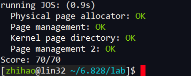
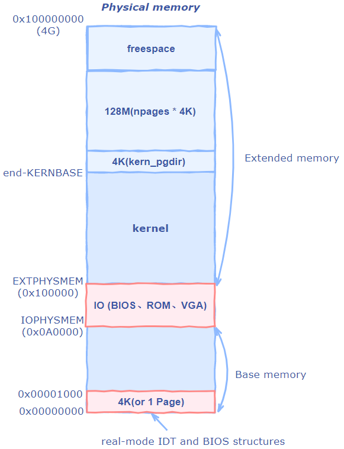
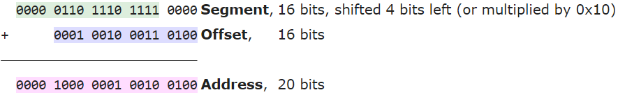
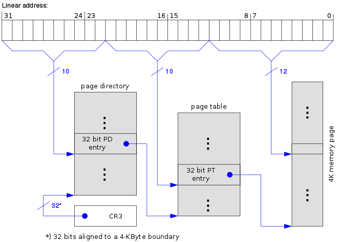
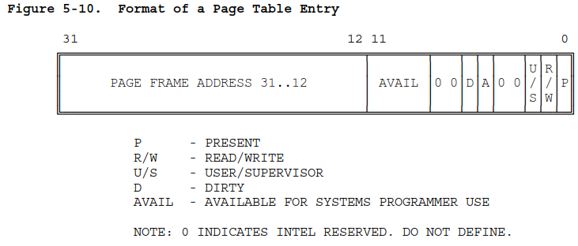
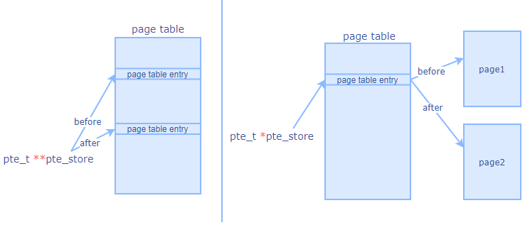
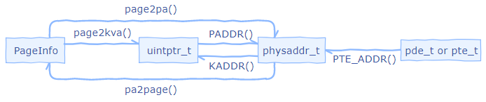

<!-- vim-markdown-toc GFM -->

* [Lab 2: Memory Management](#lab-2-memory-management)
    * [Part 1: Physical Page Management](#part-1-physical-page-management)
        * [Exercise 1.](#exercise-1)
            * [1. 函数介绍](#1-函数介绍)
            * [2. 函数实现](#2-函数实现)
    * [Part 2: Virtual Memory](#part-2-virtual-memory)
        * [Virtual, Linear, and Physical Addresses](#virtual-linear-and-physical-addresses)
        * [Exercise 3.](#exercise-3)
        * [Reference counting](#reference-counting)
        * [Page Table Management](#page-table-management)
        * [Exercise 4.](#exercise-4)
            * [1. 函数介绍](#1-函数介绍-1)
            * [2. 实现中涉及的函数：](#2-实现中涉及的函数)
            * [3. 函数实现](#3-函数实现)
    * [Part 3: Kernel Address Space](#part-3-kernel-address-space)
        * [Permissions and Fault Isolation](#permissions-and-fault-isolation)
        * [Initializing the Kernel Address Space](#initializing-the-kernel-address-space)
        * [Exercise 5.](#exercise-5)
* [附录](#附录)
    * [函数关系](#函数关系)
    * [函数定义](#函数定义)
    * [虚拟内存映射](#虚拟内存映射)
* [问题](#问题)
* [犯错](#犯错)

<!-- vim-markdown-toc -->
# Lab 2: Memory Management
**完成情况：**


## Part 1: Physical Page Management
### Exercise 1.  
>In the file  kern/pmap.c, you must implement code for the following functions (probably in the order given).
>
>`boot_alloc()`  
>`mem_init()`  (only up to the call to  `check_page_free_list(1)`)  
>`page_init()`  
>`page_alloc()`  
>`page_free()`

#### 1. 函数介绍
1. static void * `boot_alloc`(uint32_t n)：属于临时的空间分配器，JOS最开始配置虚拟内存的时候用到。真正的内存分配由page_alloc()完成。传入n个字节，返回一个4k对齐空间的起始地址。
2. void `mem_init`(void)：用于初始化内核空间、初始化二级页表，其中`kern_pgdir`表示页目录起始位置。
3. void `page_init`(void)： 用于初始化页面。`page_free_list`表示空闲物理块的链表。每个节点为`PageInfo`结构体，表示一个物理页，页面中`pp_ref`表示物理页被映射的次数，值为0表示空闲。
4. struct PageInfo * `page_alloc`(int alloc_flags) ：从`page_free_list`中取出一块物理页并返回。
5. void `page_free`(struct PageInfo *pp)： 将物理页`pp`重新链接回`page_free_list`链表

#### 2. 函数实现
**boot_alloc:**
```c
static void *
boot_alloc(uint32_t n)
{
    static char *nextfree;  // virtual address of next byte of free memory
    char *result;

    // Initialize nextfree if this is the first time.
    // 'end' is a magic symbol automatically generated by the linker,
    // which points to the end of the kernel's bss segment:
    // the first virtual address that the linker did *not* assign
    // to any kernel code or global variables.
    if (!nextfree) {
        extern char end[];
        nextfree = ROUNDUP((char *) end, PGSIZE);
    }

    // Allocate a chunk large enough to hold 'n' bytes, then update
    // nextfree.  Make sure nextfree is kept aligned
    // to a multiple of PGSIZE.
    //
    // LAB 2: Your code here.
    cprintf("boot_alloc memory at %x\n", nextfree);
    cprintf("Next free memory at %x\n", ROUNDUP((char *) (nextfree+n), PGSIZE));
    result = nextfree;
    nextfree = ROUNDUP(nextfree+n, PGSIZE);
    return result;
}
```
**mem_init(void):**
struct PageInfo是用于表示一个物理页的结构。通过kern/pmap.h里的page2pa()可以将这个物理页映射到真实的物理地址中。
```c
     pages =(struct PageInfo *)boot_alloc(npages*sizeof(struct PageInfo));
     memset(pages, 0, npages*sizeof(struct PageInfo));   
```

**page_init :**



```c
void
page_init(void)
{
	size_t i;
	page_free_list = NULL;
	//num_iohole：在IO hole区域占用的页数. (0x100000-0xA0000)/4K=96
	int num_iohole = (EXTPHYSMEM-IOPHYSMEM)/PGSIZE;
	//num_alloc：在extended memory区域已经被占用的页数
	int num_extalloc = ((uint32_t)boot_alloc(0)-KERNBASE)/PGSIZE;
	cprintf("pageinfo size: %d\n", sizeof(struct PageInfo));
	cprintf("npages:%d\n", npages);
	cprintf("npages_basemem = %d, num_iohol = %d,num_extalloc=%d\n",npages_basemem, num_iohole, num_extalloc);
	for(i=0; i<npages; i++) {
	    if(i==0) {
	        pages[i].pp_ref = 1;
	    } else if(i >= npages_basemem && i < npages_basemem + num_iohole + num_extalloc) {
	        pages[i].pp_ref = 1;
	    } else {
	        pages[i].pp_ref = 0;
	        pages[i].pp_link = page_free_list;
	        page_free_list = &pages[i];
	    }
	}
}
```

**page_alloc:**
```c
struct PageInfo *
page_alloc(int alloc_flags) {
    // Fill this function in
    struct PageInfo *result;
    if (!page_free_list) return NULL;

    result= page_free_list;
    page_free_list = page_free_list->pp_link;
    result->pp_link = NULL;

    if (alloc_flags & ALLOC_ZERO)
        memset(page2kva(result), '\0', PGSIZE);

    return result;
}
```

**page_free:**
```c
void
page_free(struct PageInfo *pp) {
    // Fill this function in
    // Hint: You may want to panic if pp->pp_ref is nonzero or
    // pp->pp_link is not NULL.
    if(pp->pp_ref || pp->pp_link )
        panic("page is in use or it is in free list.\n");
    pp->pp_link = page_free_list;
    page_free_list = pp;
}                                                        
```
## Part 2: Virtual Memory
### Virtual, Linear, and Physical Addresses
虚拟地址到物理地址的转换：
1. 分段机制转成线性地址
2. 线性地址通过分页机制转成物理地址

分段机制例子：

[wiki link](https://en.wikipedia.org/wiki/X86_memory_segmentation)
```c
           Selector  +--------------+         +-----------+
          ---------->|              |         |           |
                     | Segmentation |         |  Paging   |
Software             |              |-------->|           |---------->  RAM
            Offset   |  Mechanism   |         | Mechanism |
          ---------->|              |         |           |
                     +--------------+         +-----------+
            Virtual                   Linear                Physical
```
分页机制：



本实验中把`boot/boot.S`内的全局描述表(GDT)中的分段机制关闭了，即把`seleclor`设置为0，`offset`限制在`0xffffffff`内。所以现在virtual address和linear address的值是一样的。
回顾lab 1的part 3. 我们引入了一个简单的页表，使得内核运行于链接地址：`0xf0100000`，而实际上它被装载于BIOS上面，即物理地址的`0x00100000`。
### Exercise 3. 
> Q: 在GDB中只能访问QEMU内存的虚拟地址。而在QEMU中，使用`xp`命令可以查看物理地址。要进入命令模式，在QEMU中按`Ctrl-a c`。现在在QEMU中使用`xp`命令，在GDB中使用x命令，看看内核的虚拟地址和物理地址有没有对应。

在文件`obj/boot/boot.asm`中设置断点、进入内核：
```as
	((void (*)(void)) (ELFHDR->e_entry))();
7d63:   ff 15 18 00 01 00       call   *0x10018
```
不断`stepi`，执行完下面语句后，内核被映射到虚拟内存高地址处
```as
	movl    %eax, %cr0                              
f0100025:   0f 22 c0                mov    %eax,%cr0
```
可以看到，最终kernel开始位于虚拟地址的`0xf0100000`处，而实际物理地址在`0x100000`

**虚拟地址：**
```as
(gdb) x/8x 0x100000                                                                       
0x100000:       0x1badb002      0x00000000      0xe4524ffe      0x7205c766                
0x100010:       0x34000004      0x8000b812      0x220f0011      0xc0200fd8      
(gdb) x/8x 0xf0100000                                                                     
0xf0100000 <_start+4026531828>: 0x1badb002      0x00000000      0xe4524ffe      0x7205c766
0xf0100010 <entry+4>:   0x34000004      0x8000b812      0x220f0011      0xc0200fd8        
```       
**物理地址：**
```as
(qemu) xp/8x 0x100000
0000000000100000: 0x1badb002 0x00000000 0xe4524ffe 0x7205c766
0000000000100010: 0x34000004 0x8000b812 0x220f0011 0xc0200fd8
(qemu) xp/8x  0xf0100000
00000000f0100000: 0x00000000 0x00000000 0x00000000 0x00000000
00000000f0100010: 0x00000000 0x00000000 0x00000000 0x00000000
```
---
因为我们处在保护模式（`boot/boot.S`中进入），所以无法直接对线性地址或物理地址进行操作。所有的内存引用都是通过`MMU(Memory management unit)`将虚拟地址转换为物理地址，这也意味着**所有的C指针都是虚拟地址**。
JOS内核需要时不时地操作虚拟地址或物理地址，比如在physical memory allocator中就是这种情况。为了文档的可读性，JOS代码将其分为两种地址类型：1. `unitptr_t` 2. `physaddr_t`。第一种表示虚拟地址，第二种表示物理地址。这两种类型其实都是32-bit整型(`uint32_t`),所以两种类型互相赋值是可以的，编译器不会报错。但是对它们解引用编译器就会报错，因为他们是整型。
JOS可以先把`uintptr_t`转换成指针类型再解引用。然而，内核不能对物理地址解引用，因为`MMU`管理所有的解引用操作。如果解引用一个物理地址，它会把这物理地址当做虚拟地址来解引用，取得的值可能就不是我们想要的值了。
总的来说:
| C type       	| Address type 	|
|--------------	|--------------	|
| T*           	| Virtual      	|
| uintptr_t    	| Virtual      	|
| physaddr_t   	| Physical     	| 

---

>Q: Assuming that the following JOS kernel code is correct, what type should variable `x` have, `uintptr_t` or `physaddr_t`?
>
>	_mystery_t_ x;
>	char* value = return_a_pointer();
>	*value = 10;
>	x = (_mystery_t_) value;

`value`可以运用解引用符号，是虚拟地址，因此`x`也是虚拟地址，即`uintptr_t`

---
JOS内核有时需要读写内存，但是只知道这些内存的物理地址。比如，添加一个页表的时候需要分配物理内存，然后在页目录中添加这个页目录项并初始化这块页表空间。然而，内核不能直接分配物理空间，必须经由虚拟地址到物理地址的转化。JOS将以`0x0`开始的物理地址映射到`0xf0000000`开始的虚拟地址，目的是让内核读写那些只知道物理地址的内存地址，因为它们之间的映射关系差值不变，可以轻松地进行物理地址和虚拟地址的转化。比如，要想把物理地址翻译成我们能操作、能读写的虚拟地址，内核只要给物理地址加上`0xf0000000`。在内核中，这个操作对应函数`KADDR(pa)`。

JOS内核有时也需要算出一些数据结构虚拟地址对应的物理地址。利用`PADDR(va)`函数就能给虚拟地址减去`0xf0000000`获得物理地址。

### Reference counting
在后面的几个实验中我们会有一个物理页同时映射到许多个虚拟地址上的情况。在`struct PageInfo`的`pp_ref`中记录着每个物理页被映射的次数。当`pp_ref`为0，说明该物理页可以被释放，因为没人在用这个物理页了。通常来说，这个次数的值和物理地址在页表中`UTOP`以下的页表数目是一样的（`UTOP`以上的是内核启动时分配的，不能够变动）。
当使用`page_alloc`的时候，返回的页面`pp_ref`值为0，所以一旦我们使用这块页面的时候，要马上加1（比如将其插入页表）。有时这个操作是由其他函数处理的（比如`page_insert`）。

### Page Table Management
现在，我们要写程序来管理`页表`：插入和删除线性地址和物理地址之间的映射，以及在需要的时候创建`页表页`(page table pages)，即一页的页表。

**1. 概念**

该实验用的内存管理机制是`二级页表`，通过linear address可以访问具体页面的数据。

页目录（第一级页表）：一个页目录有一页(4KB)大小。
页目录项：格式与页表项相同,格式如下



页表（第二级页表）：同样一个页表4KB大小。
页表项：与页目录项格式相同。
线性地址：因关闭分段机制，线性地址即虚拟地址相同，格式如下：
```c
// A linear address 'la' has a three-part structure as follows:
//
// +--------10------+-------10-------+---------12----------+
// | Page Directory |   Page Table   | Offset within Page  |
// |      Index     |      Index     |                     |
// +----------------+----------------+---------------------+
//  \--- PDX(la) --/ \--- PTX(la) --/ \---- PGOFF(la) ----/
//  \---------- PGNUM(la) ----------/
```
物理地址（Page Frame Address）：格式与页表项类似，高20位作为地址，但低12位都设为0。JOS内核中的类型physaddr指的是物理地址，而它的值表示一个页（page）的开始，而不是内存中每个字节的物理地址。由线性地址索引数可以看出二级页表能总共能表示2^10^*2^10^=1MB个页面，总共可以表示1M*4K=4G的地址空间。

**2. 线性地址转换为页面**
寄存器`CR3`找到`页目录`起始位置 -> 计算`线性地址`高10位得索引，计算出`页目录项`位置 -> 取`页目录项值`，找指定`页表`起始位置 -> 线性地址12-21位计算`页表项`位置 -> 取`页表项值`、取得线性地址低10位`偏移值`，最终得到页面的起始位置及其长度。

### Exercise 4.
>In the file  kern/pmap.c, you must implement code for the following functions.
>
>`pgdir_walk()`
>`boot_map_region()`
>`page_lookup()`
>`page_remove()`
>`page_insert()`
>
>`check_page()`, called from  `mem_init()`, tests your page table management routines. You should make sure it reports success before proceeding.

#### 1. 函数介绍
1. pte_t * `pgdir_walk`(pde_t *pgdir, const void *va, int create)：返回虚拟地址`va`指向的页表项。`create`表示在未找到页表项时是否新建一个页表。
2. static void `boot_map_region`(pde_t *pgdir, uintptr_t va, size_t size, physaddr_t pa, int perm)：将虚拟地址`[va, va+size)`映射到物理地址`[pa, pa+size)`，其中`va`和`pa`都已经4k对齐。
3. struct PageInfo *`page_lookup`(pde_t *pgdir, void *va, pte_t **pte_store)：返回虚拟地址`va`对应的页面。`*pte_store`表示指向`va`对应页表项的指针。
 4. void `page_remove`(pde_t *pgdir, void *va)：删除`va`对应页面。
5. int `page_insert`(pde_t *pgdir, struct PageInfo *pp, void *va, int perm)：创建`va`对应的页表项到页面pp的映射。
 
#### 2. 实现中涉及的函数：
 [函数定义](#函数定义)
  [函数关系](#函数关系)
#### 3. 函数实现
**pgdir_walk：**
```c
pte_t *
pgdir_walk(pde_t *pgdir, const void *va, int create)
{
    //fill this function in
    pde_t *pde = NULL; //page directory entry
    pte_t *pt = NULL; //page table
    uintptr_t pdx = PDX(va); //page directory index
    uintptr_t ptx = PTX(va); //page table index
    struct PageInfo *pp; //pysical page

    *pde = pgdir[pdx];
    if(*pde & PTE_P){ //判断该目录项是否指向某个页表
    //PTE_ADDR将pde_t类型转为physaddr_t类型,并且清空低12位，以获得物理地址。
        pt = KADDR(PTE_ADDR(*pde)); //获取pde指向的页表pt的虚拟地址
    }
    else{
        if(!create) //找不到，也不创建
            return NULL;

        pp = page_alloc(ALLOC_ZERO); //创建一个页表
        if(!pp) return NULL; //创建失败

        pp->pp_ref++;
        pt = (pte_t *)page2kva(pp); //为该页表pt分配一页空间
        *pde = PADDR(pt) | PTE_P | PTE_W | PTE_U ; //设置页目录项权限
    }
    return &pt[pdx];//返回va内要求的页表项地址。
}
```
**boot_map_region：**
```c
static void
boot_map_region(pde_t *pgdir, uintptr_t va, size_t size, physaddr_t pa, int perm)
{
    // Fill this function in
    pte_t *pte = NULL;
    for(size_t i = 0; i < size; i+=PGSIZE){
        pte = pgdir_walk(pgdir, (void *)va, 1); //循环映射，若无页表项就新建一个页表
        *pte = pa|perm|PTE_P;
        pa += PGSIZE;
        va += PGSIZE;
    }
}
```
**page_lookup：**
二级指针作为函数参数的作用: 在函数外部定义一个指针p，在函数内给指针赋值，函数结束后对指
针p生效，那么我们就需要二级指针。`pte_store`的意思就是它会指向另一个页表项。下图画出了如果传入的是`pte_t *pte_store`会发生什么。


```c
struct PageInfo *
page_lookup(pde_t *pgdir, void *va, pte_t **pte_store)
{
    // Fill this function in
    pte_t *pte = pgdir_walk(pgdir, va, 0);
    if (!pte) return NULL;
    if(!pte_store)
        *pte_store = pte;
    return pa2page(PTE_ADDR(*pte));
}
```
**page_remove：**
```c
void
page_remove(pde_t *pgdir, void *va)
{
    // Fill this function in
    pte_t *pte = NULL;
    struct PageInfo *pp = page_lookup(pgdir, va, &pte);
    if(!(*pte & PTE_P) || !pp) return;

    page_decref(pp); // The physical page will be freed if the refcount reaches 0.
    *pte = 0; // The pg table entry corresponding to 'va' should be set to 0.
    tlb_invalidate(pgdir, va); //The TLB must be invalidated if you remove an entry from the page table.
}
```
**page_insert:**
注意：考虑到可能插入一个页面到同一个位置的情况，必须先pp_ref++，再page_remove()，因为若第一次插入后，pp_ref为1，第二次插入时，先执行page_remove()，pp_ref变为0，页面被释放，我们要插入的页面pp就被链接到了page_free_list中，表明该页面可以被其他进程申请。这是不对的，我们插入的页面是已经分配好了的，这就会引起bug。所以在第一次插入时，假设pp_ref为1，先pp_ref++，再page_remove()的时候，pp_ref先变2，再变1，不会出现pp_ref被减到0而被释放的情况。
```c
int
page_insert(pde_t *pgdir, struct PageInfo *pp, void *va, int perm)
{
    // Fill this function in
    pte_t *pte = NULL;
    pte = pgdir_walk(pgdir,va,1); //If necessary, on demand, a page table should be allocated and inserted into 'pgdir'.
    if(!pte) return -E_NO_MEM;

    pp->pp_ref++; // 放在page_remove()上面，防止删除的是同一个页目录项指向的页表的同一个页表项的页面。
    // If there is already a page mapped at 'va', it should be page_remove()d.
    // The TLB must be invalidated if a page was formerly present at 'va'.
    if(*pte & PTE_P) page_remove(pgdir,va);

    *pte = page2pa(pp) | perm | PTE_P; //映射新页面
    return 0;
}
```


## Part 3: Kernel Address Space
### Permissions and Fault Isolation
内核和用户共享内存空间，所以要用权限位来限制用户能使用的内存空间。
`ULIM`以上是内核空间。`[UTOP,ULIM)`地址空间允许内核和用户读取，但不能写数据。这段空间用来向用户空间公开一些内核的数据结构。 `UTOP`以下是用户空间。
### Initializing the Kernel Address Space
### Exercise 5. 
**1. 虚拟内存映射**


>Fill in the missing code in `mem_init()` after the call to `check_page()`.
>Your code should now pass the `check_kern_pgdir()` and `check_page_installed_pgdir()` checks.

```c
boot_map_region(kern_pgdir, UPAGES, PTSIZE, PADDR(pages), PTE_U | PTE_P);

// [KSTACKTOP-KSTKSIZE, KSTACKTOP) -- 分配physical memory
// [KSTACKTOP-PTSIZE, KSTACKTOP-KSTKSIZE) -- 不分配物理内存，所以如果栈指针跑到这里面，会报错。
boot_map_region(kern_pgdir, KSTACKTOP-KSTKSIZE, KSTKSIZE, PADDR(bootstack), PTE_W | PTE_P);

//-KERNBASE = 0xffffffff-KERNBASE = 正数
boot_map_region(kern_pgdir, KERNBASE, -KERNBASE, 0, PTE_W | PTE_P);
```


>Q: 2.  What entries (rows) in the page directory have been filled in at this point? What addresses do they map and where do they point? In other words, fill out this table as much as possible:

| Entry  | Base Virtual Address          | Points to (logically):                        |
|--------|-------------------------------|-----------------------------------------------|
| 1023   | 0xffffffff                    | Page table for top 4MB of phys memory         |
| 1022   | 0xffbfffff                    | Page table for top 4MB of phys memory         |
| .      | . ..                          | . ..                                          |
| 960    | 0xf0000000(KERNBASE)          | Page table for top 4MB of phys memory         |
| 959.99 | 0xefff8000(KSTACKTOP-KSTSIZE) | Kernel stack                                  |
| .      | . ..                          | . ..                                          |
| 958    | 0xef800000(MMIOBASE)          | Memory-mapped IO                              |
| 957    | 0xef400000(UVPT)              | User read-only virtual page table             |
| 956    | 0xef000000(UPAGE)             | Read-only copies of the Page structures       |
| 955    | 0xeec00000(UENVS)             | Read-only copies of the global env structures |
| .      | . ..                          | . ..                                          |
| 2      | 0x00800000                    | 0                                             |
| 1      | 0x00400000                    | 0                                             |
| 0      | 0x00000000                    | 0                                             |

>Q: 3. We have placed the kernel and user environment in the same address space. Why will user programs not be able to read or write the kernel's memory? What specific mechanisms protect the kernel memory?

通过设置PTE_U位，使得用户能访问，默认权限是root。

>Q: 4.  What is the maximum amount of physical memory that this operating system can support? Why?

2G，因为UPAGE空间为4M，一个struct PageInfo占8Byte，所以UPAGE能存储4M/8B = 512K个PageInfo。而一个PageInfo指向大小为4K的页面，所以最大物理空间为512K*4K = 2G

>Q: 5.  How much space overhead is there for managing memory, if we actually had the maximum amount of physical memory? How is this overhead broken down?

**线性地址翻译过程**：pgdir->pgtable->page。其中页表项(uint32_t)都为4B大小，一个页面大小为4K，指向一个page需要一个PageInfo(8B)。

**计算**：
page个数：maximum size / 页面大小 = 2G/4KB = 512K个 

page大小：512K*sizeof(PageInfo)=512K*8B=4M

pgtable大小：page个数 * sizeof(entry) =  512K * 4B = 2M

pgtable 个数：pgtable大小 / 页面大小 = 2M/4K = 512B 个

pgdir大小 = pgtable个数 * sizeof(PageInfo) = 512B * 8B = 4K

总大小为page大小+pgtable大小+pgdir大小 = 4M + 2M +4K = 6M+4K

>Q: 6.  Revisit the page table setup in  kern/entry.S  and  kern/entrypgdir.c. Immediately after we turn on paging, EIP is still a low number (a little over 1MB). At what point do we transition to running at an EIP above KERNBASE? What makes it possible for us to continue executing at a low EIP between when we enable paging and when we begin running at an EIP above KERNBASE? Why is this transition necessary?

`jmp *%eax`后，跳转到高地址执行。能继续执行是因为`entry_pgdir`也将虚拟地址[0, 4M) 映射到物理地址[0,4M),因此能继续往下运行。后面`kern_pgdir`加载后，虚拟地址低4M不再作为内核空间，因此需要跳转。


# 附录
## 函数关系

## 函数定义

**inc/mmu.h**
```c
#define PTXSHIFT    12      // offset of PTX in a linear address
#define PDXSHIFT    22      // offset of PDX in a linear address
// Address in page table or page directory entry
#define PTE_ADDR(pte)   ((physaddr_t) (pte) & ~0xFFF)
// page directory index
#define PDX(la)     ((((uintptr_t) (la)) >> PDXSHIFT) & 0x3FF)
// page table index
#define PTX(la)     ((((uintptr_t) (la)) >> PTXSHIFT) & 0x3FF)
```

**./inc/memlayout.h**
```c
typedef uint32_t pte_t;
typedef uint32_t pde_t;
```
**kern/pmap.h:**
```c
/* This macro takes a physical address and returns the corresponding kernel
 * virtual address.  It panics if you pass an invalid physical address. */
#define KADDR(pa) _kaddr(__FILE__, __LINE__, pa)
 static inline void*
 _kaddr(const char *file, int line, physaddr_t pa)

#define PADDR(kva) _paddr(__FILE__, __LINE__, kva)
static inline physaddr_t _paddr(const char *file, int line, void *kva)

```
**inc/types.h:**
```c
// Pointers and addresses are 32 bits long.
// We use pointer types to represent virtual addresses,
// uintptr_t to represent the numerical values of virtual addresses,
// and physaddr_t to represent physical addresses.
typedef int32_t intptr_t;
typedef uint32_t uintptr_t;
typedef uint32_t physaddr_t;
```
```c
static inline physaddr_t
page2pa(struct PageInfo *pp)
{
    return (pp - pages) << PGSHIFT
}

static inline struct PageInfo*
pa2page(physaddr_t pa)
{
    if (PGNUM(pa) >= npages)
        panic("pa2page called with invalid pa");
    return &pages[PGNUM(pa)];
}

static inline void*
page2kva(struct PageInfo *pp)
{
    return KADDR(page2pa(pp));
```

## 虚拟内存映射
```c
/*
 * Virtual memory map:                                Permissions
 *                                                    kernel/user
 *
 *    4 Gig -------->  +------------------------------+
 *                     |                              | RW/--
 *                     ~~~~~~~~~~~~~~~~~~~~~~~~~~~~~~~~
 *                     :              .               :
 *                     :              .               :
 *                     :              .               :
 *                     |~~~~~~~~~~~~~~~~~~~~~~~~~~~~~~| RW/--
 *                     |                              | RW/--
 *                     |   Remapped Physical Memory   | RW/--
 *                     |                              | RW/--
 *    KERNBASE, ---->  +------------------------------+ 0xf0000000      --+
 *    KSTACKTOP        |     CPU0's Kernel Stack      | RW/--  KSTKSIZE   |
 *                     | - - - - - - - - - - - - - - -|                   |
 *                     |      Invalid Memory (*)      | --/--  KSTKGAP    |
 *                     +------------------------------+                   |
 *                     |     CPU1's Kernel Stack      | RW/--  KSTKSIZE   |
 *                     | - - - - - - - - - - - - - - -|                 PTSIZE
 *                     |      Invalid Memory (*)      | --/--  KSTKGAP    |
 *                     +------------------------------+                   |
 *                     :              .               :                   |
 *                     :              .               :                   |
 *    MMIOLIM ------>  +------------------------------+ 0xefc00000      --+
 *                     |       Memory-mapped I/O      | RW/--  PTSIZE
 * ULIM, MMIOBASE -->  +------------------------------+ 0xef800000
 *                     |  Cur. Page Table (User R-)   | R-/R-  PTSIZE
 *    UVPT      ---->  +------------------------------+ 0xef400000
 *                     |          RO PAGES            | R-/R-  PTSIZE
 *    UPAGES    ---->  +------------------------------+ 0xef000000
 *                     |           RO ENVS            | R-/R-  PTSIZE
 * UTOP,UENVS ------>  +------------------------------+ 0xeec00000
 * UXSTACKTOP -/       |     User Exception Stack     | RW/RW  PGSIZE
 *                     +------------------------------+ 0xeebff000
 *                     |       Empty Memory (*)       | --/--  PGSIZE
 *    USTACKTOP  --->  +------------------------------+ 0xeebfe000
 *                     |      Normal User Stack       | RW/RW  PGSIZE
 *                     +------------------------------+ 0xeebfd000
 *                     |                              |
 *                     |                              |
 *                     ~~~~~~~~~~~~~~~~~~~~~~~~~~~~~~~~
 *                     .                              .
 *                     .                              .
 *                     .                              .
 *                     |~~~~~~~~~~~~~~~~~~~~~~~~~~~~~~|
 *                     |     Program Data & Heap      |
 *    UTEXT -------->  +------------------------------+ 0x00800000
 *    PFTEMP ------->  |       Empty Memory (*)       |        PTSIZE
 *                     |                              |
 *    UTEMP -------->  +------------------------------+ 0x00400000      --+
 *                     |       Empty Memory (*)       |                   |
 *                     | - - - - - - - - - - - - - - -|                   |
 *                     |  User STAB Data (optional)   |                 PTSIZE
 *    USTABDATA ---->  +------------------------------+ 0x00200000        |
 *                     |       Empty Memory (*)       |                   |
 *    0 ------------>  +------------------------------+                 --+
```
# 问题
1. //num_alloc：在extended memory区域已经被占用的页的个数
     int num_alloc = ((uint32_t)boot_alloc(0) - KERNBASE) / PGSIZE;
上面没有明白，为什么num_alloc是减掉KERNBASE，不应该是减到io hole的地方吗？
答：这里计算的是虚拟地址相减，之前我看成了物理内存的布局。
2. 为什么exercise 4里的pgdir_walk函数中的*pde = PADDR(pte) | PTE_P | PTE_W | PTE_U可以直接操作物理内存，在保护模式下不是所有指针都是虚拟地址吗？
答：这里并没有操作物理内存，只是把物理地址设置了一些权限存到页目录项里而已
3. 为什么PADDR(pte)，KADDR(PTE_ADDR(*pde))？
答：因为PADDR参数是void*，KADDR参数是pysaddr_t。并且取qde时需要清空其权限位。
4. 为什么PTE_ADDR清空pde低十二位
答：因为pde和pte的结构是一样的，pde清空权限位，获取页表物理地址。
5. 为什么`pp = page_alloc(ALLOC_ZERO);//创建一个页表`  是ALLOC_ZERO  ，不是1？

# 犯错
1. 指针问题
```c
pde_t *pde = NULL; 
pde = &pgdir[pdx]; //表示pde指向pgdir[pdx]所在的页目录项
```
我写成了*pde = pgdir[pdx]; 表示修改pde所指向的值为pgdir[pdx]，而且pde值NULL，所以出错。


                                          
                                
                                                
