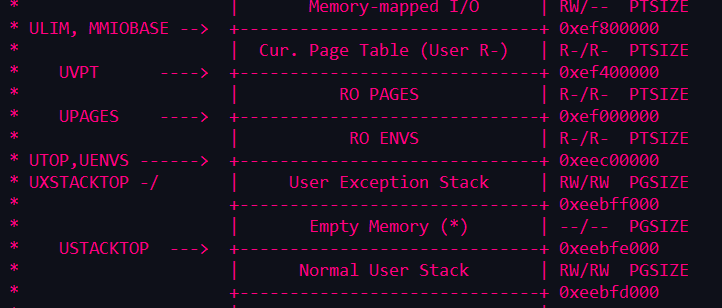
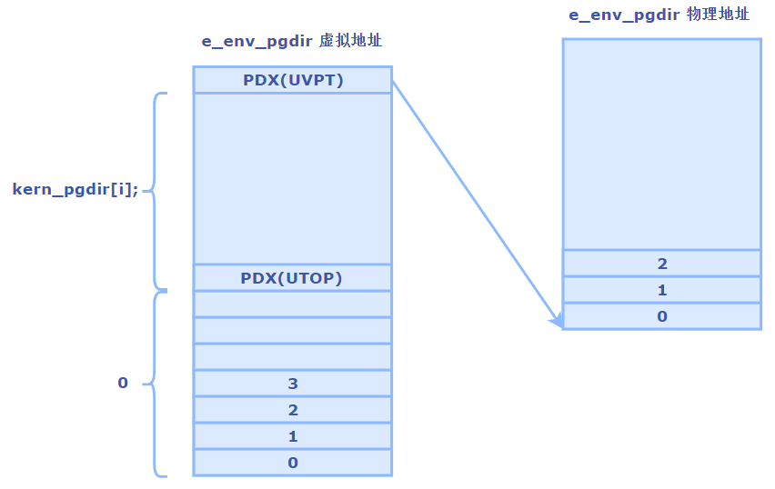
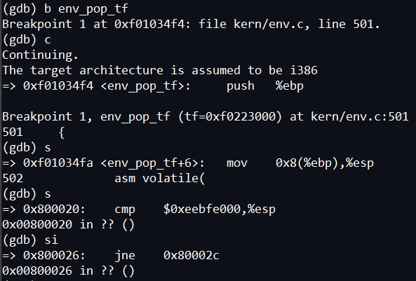
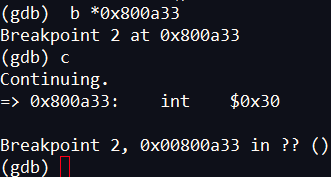
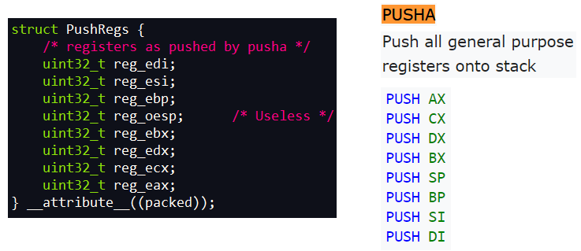
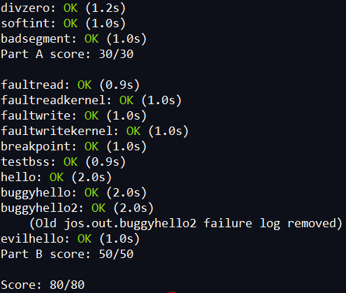

# 目录
<!-- vim-markdown-toc GFM -->

* [Lab 3: User Environments](#lab-3-user-environments)
    * [Part A: User Environments and Exception Handling](#part-a-user-environments-and-exception-handling)
        * [Environment State](#environment-state)
        * [Allocating the Environments Array](#allocating-the-environments-array)
            * [Exercise 1](#exercise-1)
        * [Creating and Running Environments](#creating-and-running-environments)
            * [Exercise 2.](#exercise-2)
        * [Handling Interrupts and Exceptions](#handling-interrupts-and-exceptions)
            * [Exercise 3.](#exercise-3)
        * [Basics of Protected Control Transfer](#basics-of-protected-control-transfer)
        * [Types of Exceptions and Interrupts](#types-of-exceptions-and-interrupts)
        * [An Example](#an-example)
        * [Nested Exceptions and Interrupts](#nested-exceptions-and-interrupts)
        * [Setting Up the IDT](#setting-up-the-idt)
            * [Exercise 4.](#exercise-4)
            * [Questions](#questions)
    * [Part B: Page Faults, Breakpoints Exceptions, and System Calls](#part-b-page-faults-breakpoints-exceptions-and-system-calls)
        * [Handling Page Faults](#handling-page-faults)
            * [Exercise 5.](#exercise-5)
        * [The Breakpoint Exception](#the-breakpoint-exception)
            * [Exercise 6.](#exercise-6)
            * [Questions](#questions-1)
        * [System calls](#system-calls)
            * [Exercise 7.](#exercise-7)
        * [User-mode startup](#user-mode-startup)
            * [Exercise 8.](#exercise-8)
        * [Page faults and memory protection](#page-faults-and-memory-protection)
            * [Exercise 9/10.](#exercise-910)
    * [问题](#问题)
    * [自问自答：](#自问自答)

<!-- vim-markdown-toc -->

# Lab 3: User Environments

## Part A: User Environments and Exception Handling

一些全局变量的作用：  
```
struct Env *envs = NULL;		// All environments
struct Env *curenv = NULL;		// The current env
static struct Env *env_free_list;	// Free environment list
NENV： 最多有NENV个环境同时运行
```

### Environment State

inc/env.h中的Env结构体：  
```c
struct Env {
	struct Trapframe env_tf;	// Saved registers
	struct Env *env_link;		// Next free Env
	envid_t env_id;			// Unique environment identifier
	envid_t env_parent_id;		// env_id of this env's parent
	enum EnvType env_type;		// Indicates special system environments
	unsigned env_status;		// Status of the environment
	uint32_t env_runs;		// Number of times environment has run

	// Address space
	pde_t *env_pgdir;		// Kernel virtual address of page dir
};
```

像Unix进程一样，JOS环境将“线程”和“地址空间”的概念结合在一起。**线程**主要由保存的寄存器（env_tf字段）定义，**地址空间**由env_pgdir指向的页目录和页表定义。 要想运行一个环境，两样都要配置好。  
在JOS中，各个环境不像xv6中的进程那样具有自己的内核堆栈。 在内核中，一次只能有一个活动的JOS环境，因此JOS只需要一个内核堆栈。

### Allocating the Environments Array

#### Exercise 1

修改kern/pmap.c中的mem_init()来分配和映射envs数组。分配的页面权限为用户只读(inc/memlayout.h有定义)，这样用户就能读取该数组。

```c
    // LAB 3: Your code here.
    envs =(struct Env *)boot_alloc(NENV*sizeof(struct Env));
    memset(envs, 0, NENV*sizeof(struct Env));
    
    // LAB 3: Your code here.
    boot_map_region(kern_pgdir, UENVS, PTSIZE, PADDR(envs), PTE_U | PTE_P);
```

### Creating and Running Environments
#### Exercise 2.

在kern/env.c中, 完成如下函数：  
env_init()，env_setup_vm()，region_alloc()，load_icode()，env_create()，env_run()
作用如下：   
* env_init()：  
初始化envs数组中的所有Env结构体，并将它们添加到env_free_list中。并且调用env_init_percpu，它用不同的段为特权级别0(内核)和特权级别3(用户)配置分段硬件。  
* env_setup_vm()：  
为新环境分配一个页面目录，并初始化新环境地址空间的内核部分。  
* region_alloc()：  
为环境分配和映射物理内存。  
* load_icode()： 
需要解析一个ELF二进制映像，就像boot loader程序一样，并将其内容加载到新环境的用户地址空间中。  
* env_create()：  
使用env_alloc分配一个环境，并调用load_icode将ELF二进制文件加载到其中。  
* env_run()：  
在用户态中运行该环境。

1. env_init(void):

将`envs`数组设为free, env_id置为0, 并插入`env_free_list`.  
确保env_free_list中的顺序和envs数组中的顺序是一样的.  这里我们用头插法
```c
void                                     
env_init(void)                           
{                                        
    // Set up envs array                 
    // LAB 3: Your code here.            
                                         
    for(int i = NENV-1; i >= 0; i--){    
		envs[i].env_status = ENV_FREE;
        envs[i].env_id = 0;              
        envs[i].env_link = env_free_list;
        env_free_list = &envs[i];        
    }                                    
                                         
    // Per-CPU part of the initialization
    env_init_percpu();                   
}                                        
```

2. env_setup_vm(struct Env *e)

设置e->env_pgdir, 初始化页目录, 该页目录有两部分组成, `内核部分`和`用户部分`. 内核部分直接复制kern_pgdir, 用户部分设为0. 实现方法和lab2类似, 用到了mem_init和pgdir_walk中的一些代码.

Virtual Memory Map:  
 


```c
    e->env_pgdir = (pde_t *)page2kva(p);                          
    //increment env_pgdir's pp_ref for env_free to work correctly 
    p->pp_ref++;                                                  
                                                                  
    // use kern_pgdir as a template                               
    //memcpy(env_pgdir, kern_pgdir, PGSIZE);                      
                                                                  
    //map the pgdir entries below UTOP                            
    for(i = 0; i < PDX(UTOP); i++){                               
        e->env_pgdir[i] = 0;                                      
    }                                                             
    //map entries above UTOP                                      
    for(; i < NENV; i++){                                         
        e->env_pgdir[i] = kern_pgdir[i];                          
    }                                                             
                                                                  
    //UVPT对应的页目录项指向该env_pgdir页目录表                   
    //Permissions: kernel R, User R                               
    e->env_pgdir[PDX(UVPT)] = PADDR(e->env_pgdir) | PTE_P | PTE_U;
                                                                  
    return 0;                                                     
```

3. region_alloc(struct Env *e, void *va, size_t len)

为环境e在虚拟地址va处分配len字节的物理内存.  页面对`用户`和`内核`是可写的. 若分配失败, 需要写`panic`语句

先分配页面, 然后用page_insert插入到页目录中.
```c
static void                                                         
region_alloc(struct Env *e, void *va, size_t len)                   
{                                                                   
    // LAB 3: Your code here.                                       
    // (But only if you need it for load_icode.)                    
    //                                                              
    // Hint: It is easier to use region_alloc if the caller can pass
    //   'va' and 'len' values that are not page-aligned.           
    //   You should round va down, and round (va + len) up.         
    //   (Watch out for corner-cases!)                              
                                                                    
    void * beg = ROUNDDOWN(va, PGSIZE);                             
    void * end = ROUNDUP(va+len, PGSIZE);                           
                                                                    
    struct PageInfo *pp = NULL;                                     
    for(void * i = beg; i < end; i+= PGSIZE){                       
        pp = page_alloc(ALLOC_ZERO);                                
        if(pp == NULL){                                             
            panic("region_alloc() failed.");                        
        }                                                           
                                                                    
        int ret = page_insert(e->env_pgdir, pp, i, PTE_W | PTE_U);  
        if(ret < 0){                                                
            panic("region_alloc() failed: %e", ret);                
        }                                                           
    }                                                               
}                                                                   
```

4. load_icode(struct Env *e, uint8_t *binary)

设置用户进程的初始程序二进制、堆栈和处理器标志。
这个函数只在内核初始化期间调用，然后运行第一个用户态环境。

这个函数将ELF二进制映像中的所有可加载段加载到环境的用户内存中，从ELF程序头中指定的适当虚拟地址开始。同时，它为那些在程序头中被标记为映射，但实际上不存在于ELF文件中的段（即程序的bss部分）置为0。

该函数和boot loader很像， 但是bootloader 是从硬盘中读取代码。可以从boot/main.c中参考代码。注意，加载程序前记得加载地址空间为用户页表

最后，这个函数为程序的初始堆栈映射一个页面。

```c
    // LAB 3: Your code here.                                           
    struct Elf *ELFHDR = (struct Elf *)binary;                          
    struct Proghdr *ph, *eph;                                           
                                                                        
    // is this a valid ELF?                                             
    if (ELFHDR->e_magic != ELF_MAGIC)                                   
        panic("Not a valid ELF");                                       
                                                                        
    // load each program segment (ignores ph flags)                     
    ph = (struct Proghdr *) ((uint8_t *) ELFHDR + ELFHDR->e_phoff);     
    eph = ph + ELFHDR->e_phnum;                                         
                                                                        
    // ??5. Use lcr3() to switch to its address space.                  
    lcr3(PADDR(e->env_pgdir));                                          
                                                                        
    for (; ph < eph; ph++){                                             
        if(ph->p_type == ELF_PROG_LOAD){                                
            region_alloc(e, (void *)ph->p_va, ph->p_memsz);             
                                                                        
            // Any remaining memory bytes should be cleared to zero.    
            memset((void *)ph->p_va, 0, ph->p_memsz);                   
            // The ELF header should have ph->p_filesz <= ph->p_memsz.  
            memcpy((void *)ph->p_va, binary+ph->p_offset, ph->p_filesz);
        }                                                               
    }                                                                   
                                                                        
    // call the entry point from the ELF header                         
    e->env_tf.tf_eip = ELFHDR->e_entry;                                 
    lcr3(PADDR(kern_pgdir));                                            
                                                                        
    // Now map one page for the program's initial stack                 
    // at virtual address USTACKTOP - PGSIZE.                           
                                                                        
    // LAB 3: Your code here.                                           
    region_alloc(e, (void *)USTACKTOP - PGSIZE, PGSIZE);                
```

5. env_create(uint8_t *binary, enum EnvType type)

用env_alloc分配一个新环境，用load_icode加载命名的elf二进制文件，并设置它的env_type。这个函数只在**内核初始化**期间调用，然后运行第一个用户态环境。新环境的父ID被设置为0。

```c
void
env_create(uint8_t *binary, enum EnvType type)
{
    // LAB 3: Your code here.
    struct Env *env = NULL;
    int ret = env_alloc(&env, 0);
    if(ret < 0){
        panic("region_alloc() failed: %e", ret);
    }

    load_icode(env, binary);
    env->env_type = type;
}
```
6. env_run(struct Env *e)

上下文环境由curenv切换到`e`。 若这是第一次运行env_run， 当前环境curenv为NULL

```c
void
env_run(struct Env *e)
{
    // Step 1: If this is a context switch (a new environment is running):
    //     1. Set the current environment (if any) back to
    //        ENV_RUNNABLE if it is ENV_RUNNING (think about
    //        what other states it can be in),
    //     2. Set 'curenv' to the new environment,
    //     3. Set its status to ENV_RUNNING,
    //     4. Update its 'env_runs' counter,
    //     5. Use lcr3() to switch to its address space.
    // Step 2: Use env_pop_tf() to restore the environment's
    //     registers and drop into user mode in the
    //     environment.

    // Hint: This function loads the new environment's state from
    //  e->env_tf.  Go back through the code you wrote above
    //  and make sure you have set the relevant parts of
    //  e->env_tf to sensible values.

    // LAB 3: Your code here.
    if(curenv && curenv->env_status == ENV_RUNNING)
        curenv->env_status = ENV_RUNNABLE;
    curenv = e;
    curenv->env_status = ENV_RUNNING;
    curenv->env_runs++;
    lcr3(PADDR(curenv->env_pgdir));

    env_pop_tf(&curenv->env_tf);

    //panic("env_run not yet implemented");
}
```

下面是在调用用户代码之前的代码调用图:  

-   `start`  (`kern/entry.S`)
-   `i386_init`  (`kern/init.c`)
    -   `cons_init`
    -   `mem_init`
    -   `env_init`
    -   `trap_init`  (still incomplete at this point)
    -   `env_create`
    -   `env_run`
        -   `env_pop_tf`

完成之后，在QEMU下运行。正常来说，系统会用户空间并执行hello二进制代码，直到它跑到系统中断`int`。这时会出现问题，因为JOS没有设置硬件来允许从用户空间到内核的转换。当CPU发现它没有建立这个系统调用中断处理,会生成一个异常,发现它无法处理,生成一个`double fault`异常,发现还是无法处理,最后抛出“triple fault”。通常，会看到CPU重置和重新启动。但这里用了6.828补丁的QEMU，只会看到一个寄存器信息和一个“triple fault”消息。

这个问题后面会解决，现在先检查有没有正常进入用户态  
在env_pop_tf设置断点，这个函数是进入用户态前执行的最后一个函数。若正常，会像下面这样：  

  

Now use b *0x... to set a breakpoint at the `int $0x30` in `sys_cputs()` in hello (see obj/user/hello.asm for the user-space address
然后找`obj/user/hello.asm`中的`sys_cputs()`中的`int $0x30` ，设置断点。`continue`到当前行，若不能跑到这里，说明前面的代码有问题，需要改正

  

### Handling Interrupts and Exceptions

一旦执行到`int $0x30`，需要系统调用，程序就卡住了，因为目前只能进入用户态，但出不来。现在需要实现一些基本的异常和系统调用句柄，以便让内核从用户态中接管cpu的控制权。首先要彻底熟悉x86中断和异常机制

#### Exercise 3.
读手册第九章.Exceptions and Interrupts

中断和异常之间的区别是：中断用于处理处理器外部的异步事件，而异常处理处理器本身在执行指令过程中检测到的条件。

### Basics of Protected Control Transfer

`exception` 和 `interrupts`都是“受保护的控制权转移”，会让处理器从用户态转到内核态(`CPL=0`)。
interrupts是由异步事件引起的，比如外部IO活动的消息通知。
exception是由当前代码同步引起的，比如除以0或访问无效内存

处理器的中断异常机制能确保当前运行的代码在出现中断异常的时候，内核能进入指定的控制条件中。在x86中，有两种机制共同协作确保控制权的安全转移：  
1. **The Interrupt Descriptor Table** (中断描述符表)。
x86提供了256个不同的中断向量， 也就是0-255的数字，代表不同的异常情况。CPU用这些中断向量作为`IDT`(Interrupt Descriptor Table)的索引，这个IDT只能内核访问，和GDT很像。找到后，CPU就加载该IDT项：  
* 其中一个值加载到`EIP`寄存器，指向指定用于处理此类异常的内核代码。
* 另一个值加载到`CS`寄存器，在位0-1中包括运行异常处理程序的特权级别。 (在JOS中，所有异常都在内核模式下处理，权限级别为0。)
2. **The Task State Segment.**  (任务状态段)
处理器处理的时候需要保存旧的处理器状态，如`EIP`和`CS`值，以便恢复现场。但是旧处理器状态的这个保存区域必须依次受到保护，以防受到非特权用户态代码的影响。否则，恶意代码会损害内核。  
因此在处理中断异常的时候，处理器会切换到内核当中的一个栈中，这个栈的结构叫做`task state segment`(TSS)。处理器会把`SS, ESP, EFLAGS, CS, EIP`, 和一个`error code`放进来。 然后从interrupt descriptor中加载`CS` 和 `EIP`，最后设置`ESP`和`SS`来建立新的栈。  
虽然TSS很强大，能用于多种目的，但JOS中只用TSS来实现从用户态到内核态的转换。由于JOS中的“内核模式”在x86上的特权级别为0，因此处理器在进入内核模式时使用TSS的`ESP0`和`SS0`字段来定义内核堆栈。 其他TSS字段JOS不作使用。

### Types of Exceptions and Interrupts

x86处理器可在内部生成的所有同步异常使用的中断向量在`0到31`之间，对应IDT中的0-31项。比如，页错误由中断向量为14的异常抛出。值大于31的中断向量仅由`软件中断`使用，这些中断可以由`int`指令生成，也可以由`异步硬件中断`生成。  

在本节中，我们将扩展JOS以处理x86内部生成的向量0-31异常。下一节，将使JOS处理软件中断向量48（0x30），JOS将用其作系统调用的中断向量。

### An Example

比如处理器在用户态碰到一个除0异常。
1. 处理器切换到由TSS的`SS0`和`ESP0`字段定义的堆栈，该堆栈在JOS中将分别保存值GD_KD和KSTACKTOP。
2. 处理器将异常参数从地址KSTACKTOP开始推入内核堆栈：
```c
                     +--------------------+ KSTACKTOP             
                     | 0x00000 | old SS   |     " - 4
                     |      old ESP       |     " - 8
                     |     old EFLAGS     |     " - 12
                     | 0x00000 | old CS   |     " - 16
                     |      old EIP       |     " - 20 <---- ESP 
                     +--------------------+
```  
3. 因为处理的是除法错误，对应x86上的中断向量0，所以处理器读取IDT条目0并将`CS：EIP`设置为指向该条目描述的处理函数。
4. 执行新的处理函数

某些x86异常，在上面5个words的基础上多了一个`error cdoe`，比如页错误异常，对应数字14。在从用户态到内核态的时候，栈内状态如下：  

```c
                     +--------------------+ KSTACKTOP             
                     | 0x00000 | old SS   |     " - 4
                     |      old ESP       |     " - 8
                     |     old EFLAGS     |     " - 12
                     | 0x00000 | old CS   |     " - 16
                     |      old EIP       |     " - 20
                     |     error code     |     " - 24 <---- ESP
                     +--------------------+
```

### Nested Exceptions and Interrupts

但是，只有在从`用户态进入内核`时，x86处理器才会在将旧的寄存器状态推送到堆栈之前以及通过IDT调用适当的异常处理程序之前 自动切换堆栈。  
若处理器已经在内核态，处理器会发出嵌套异常，因为它不需要切换栈，也就不会保存旧的SS或ESP寄存器。对于不需要保存error code的异常类型，内核堆栈在异常处理程序时如下所示：  
```c
                     +--------------------+ <---- old ESP
                     |     old EFLAGS     |     " - 4
                     | 0x00000 | old CS   |     " - 8
                     |      old EIP       |     " - 12
                     +--------------------+
```

对于需要保存error code的异常类型，处理器在上面的基础上在`EIP`下方再加一个error code

对于处理器的嵌套异常功能有一个重要的点：如果处理器在内核态接受异常，但由于堆栈空间不足等原因无法将其旧状态推入内核堆栈，那么处理器就无法执行任何恢复操作，它只能重置自己。但是，内核的设计应该避免这种情况的发生。

### Setting Up the IDT

现在，要设置IDT以处理中断向量0-31（处理器异常）。  
注意： 0-31范围内的一些异常由Intel定义为保留。因为处理器永远不会生成那些中断向量，所以不用去定义相关处理程序

接下来要实现的总体控制流程如下所示：
```c
      IDT                   trapentry.S         trap.c
   
+----------------+                        
|   &handler1    |---------> handler1:          trap (struct Trapframe *tf)
|                |             // do stuff      {
|                |             call trap          // handle the exception/interrupt
|                |             // ...           }
+----------------+
|   &handler2    |--------> handler2:
|                |            // do stuff
|                |            call trap
|                |            // ...
+----------------+
       .
       .
       .
+----------------+
|   &handlerX    |--------> handlerX:
|                |             // do stuff
|                |             call trap
|                |             // ...
+----------------+
```

中断处理的大体过程：  
* 出现中断异常
* 转到内核堆栈
* 处理器保存当前环境到该栈中
*  处理器根据中断向量读取IDT中对应项，设置CS:EIP指向对应处理程序。
* 处理程序解决中断异常
* 恢复原来环境，继续正常运行。

每个异常在trapentry.S中都有对应的处理程序；trap_init()应该初始化IDT，IDT中的每项对应着处理程序的函数地址；每个处理程序要构建一个`struct Trapframe`(inc/trap.h中)，并压入栈中，esp指向该Trapframe，然后调用trap()(在trap.c中)；trap()处理异常，或 把异常交给指定处理函数。
#### Exercise 4.  

涉及文件：
* trapentry.S
	* `#define TRAPHANDLER(name, num)`
		* build a `Trapframe`
		* `pushl %esp`
		* `call trap`
* kern/trap.c:
	* void trap_init(void)
		* `#define SETGATE(gate, istrap, sel, off, dpl) `
	* void trap(struct Trapframe *tf)


1. 实现trapentry.S  
文件内有两个宏定义TRAPHANDLER和TRAPHANDLER_NOEC，传入函数名和中断向量后，先压入中断向量，然后执行_alltraps，压入旧的段寄存器ds和es，然后将ds和es设置为GD_KD，然后将esp压入，将这个新建立的Trapframe传入trap()处理。 题目要求通过divzero, softint, and badsegment几个文件的测试，对应如下几个中断异常。

```as
/*
 * Lab 3: Your code here for generating entry points for the different traps.
 */
TRAPHANDLER_NOEC(divide_handler, T_DIVIDE);
TRAPHANDLER(gpflt_handler, T_GPFLT);
TRAPHANDLER(pgflt_handler, T_PGFLT);
```

执行trapentry.S后内核栈的情况：
```c
+---------+----------+ KSTACKTOP
| 0x00000 + old SS   |     " + 4
|      old ESP       |     " | 8
|     old EFLAGS     |     " | 12
| 0x00000 + old CS   |     " | 16
|      old EIP       |     " | 20
|--------------------|       | <---上面保存旧环境
|     error code     |     " | 24
|      trap_num      |     " | 28
|        DS          |     " | 32
|        ES          |     " | 36
|       regs         |     " | 40  <---+ ESP
+--------------------+    
```

_alltraps中的pushal就是将通用寄存器全部压栈，对比Trapframe中的PushRegs结构可以看到是一一对应的，但是反过来的。因为反着压栈，读取时才为正确顺序。


2. 实现trap.c
	1. 实现void trap_init(void)
		* 先定义处理中断的函数，然后用SETGATE初始化IDT。
			* #define SETGATE(gate, istrap, sel, off, dpl)  是用来初始化idt数组的宏定义，一个gate discriptor表示idt数组中的某项。 所以参数:  
			gate: 为idt[i]，i为中断向量的值，如idt[T_DIVIDE]
			istrap: 若为exception(trap) gate，值1；若为interrupt gate，填0.
			sel: Code segment selector段选择符.
			off: Offset in code segment，段偏移量，
			dpl: Descriptor Privilege Level 描述符特权级别，值为0，表 内核态运行
	```c
	    void divide_handler();
	    void gpflt_handler();
	    void pgflt_handler();
	    SETGATE(idt[T_DIVIDE], 1, GD_KT, divide_handler, 0);
	    SETGATE(idt[T_GPFLT], 1, GD_KT, gpflt_handler, 0);
	    SETGATE(idt[T_PGFLT], 1, GD_KT, pgflt_handler, 0);
	```

#### Questions

1. 为每个异常/中断设置单独的处理程序功能的目的是什么？  
答： 因为不同中断异常要处理的方式不同。比如有的异常直接报错，有的中断执行完处理程序还要回到原先的地方继续执行，所以要不同的处理程序来支持多种处理方式。
2. 是否需要做任何事情来使user/softint程序正常运行？ grade脚本期望它会产生一般性保护错误（trap13），但是softint的代码显示为int $ 14。 为什么要产生中断向量13？ 如果内核实际上允许softint的int $ 14指令调用内核的页面错误处理程序（即中断向量14），会发生什么？  
答：因为当前处在用户态，而int为系统指令，会引发Genelral Protection Exception，即trap 13

## Part B: Page Faults, Breakpoints Exceptions, and System Calls

### Handling Page Faults

page fault exception(interrupt vector 14 `T_PGFLT`)是一个很重要的异常，发生异常时，异常所在的线性地址会被存储到`CR2`寄存器。

#### Exercise 5.
修改trap_dispatch()让它能够用page_fault_handler()处理page fault exceptions。
我们只需根据trap类型执行对应函数：
```c
    if(tf->tf_trapno == T_PGFLT){
        return page_fault_handler(tf);
    }
```

### The Breakpoint Exception

Breakpoint exception(interrupt vector 3 `T_BRKPT`)可以让调试器设置断点，通过把一些语句代替为一个字节的int3中断语句。

#### Exercise 6. 

修改trap_dispatch()让该异常调用kernel monitor。
```c
    if(tf->tf_trapno == T_BRKPT){
        return monitor(tf);
    }
```
trapentry.S中加入breakpoint entry point:  

```c
TRAPHANDLER_NOEC(brkpt_handler, T_BRKPT);
```
trap.c 中的trap_init()加入定义和填补idt项：

```c
    void brkpt_handler();
    SETGATE(idt[T_BRKPT], 1, GD_KT, brkpt_handler, 3);
```

注意，上面的图SETGATE中的dpl若写成0，make grade无法通过。原因在下面

#### Questions

3. breakpoint测试用例将生成breakpoint exception或general protection fault，具体取决于您如何初始化IDT中的断点条目(即从trap_init调用SETGATE)，为什么？为了使breakpoint exception按上述规定工作，您需要如何对其进行设置？什么不正确的设置将导致该异常触发general protection fault？  
若 SETGATE中的dpl设为3， 即特权级别为用户级，执行的时候会抛出breakpoint exception。若设为0，而程序从用户态调用，因为级别不够，就会抛出general protection fault。  
4. 您认为这些机制的意义何在，特别user/softint测试程序所做的事情？  
意义在于权限管理，什么权限就该干他权限内的事。

### System calls

用户进程通过调用系统调用来让内核做一些自己权限外的事情。

JOS内核中，使用 `int $x030`来引发processor interrupt，常数T_SYSCALL(48, 0x30)已经帮我们写好了，现在要额设置中断对应的描述符。注意：interrupt 0x30不是由硬件产生的，所以我们写的代码不会和硬件有冲突。

执行系统调用是，程序先把call number和参数放到寄存器，系统从寄存器中取值并执行。这样一来，内核就不用再去保存用户环境的堆栈或指令流了。系统调用号存在`%eax`，参数（最多五个）存在`%edx`, `%ecx`, `%ebx`, `%edi`, 和`%esi`。执行完后内核把返回值放在`%eax`。

#### Exercise 7.

修改kern/trapentry.S，kern/trap.c's `trap_init()` ，`trap_dispatch()`。trap_dispatch()中使用`syscall()` (defined in kern/syscall.c)来处理中断， 最后需要修改kern/syscall.c中的syscall()。确保理解lib/syscall.c中的内联汇编程序。

1. kern/trapentry.S
	添加entry point
	```c
	TRAPHANDLER_NOEC(syscall_handler, T_SYSCALL);
	```
2. kern/trap.c
	1. trap_init()
		添加syscall处理程序的定义和IDT项
	```c
	    void syscall_handler();
	    SETGATE(idt[T_SYSCALL], 0, GD_KT, syscall_handler, 3);
	```

	2. trap_dispatch()
			添加处理程序
	```c
	    if(tf->tf_trapno == T_SYSCALL){
	        tf->tf_regs.reg_eax = syscall(tf->tf_trapno,
	                tf->tf_regs.reg_edx,
	                tf->tf_regs.reg_ecx,
	                tf->tf_regs.reg_ebx,
	                tf->tf_regs.reg_edi,
	                tf->tf_regs.reg_esi);
	    }
	```
3. kern/syscall.c
		根据lib/syscall.c中定义的函数和inc/syscall.h中定义的枚举变量实现该文件。
	```c
	int32_t
	syscall(uint32_t syscallno, uint32_t a1, uint32_t a2, uint32_t a3, uint32_t a4, uint32_t a5)
	{
	    // Call the function corresponding to the 'syscallno' parameter.
	    // Return any appropriate return value.
	    // LAB 3: Your code here.

	    switch(syscallno){
	    case SYS_cputs:
	        sys_cputs((const char *)a1, (size_t)a2);
	        return 0;
	    case SYS_cgetc:
	        return sys_cgetc();
	    case SYS_getenvid:
	        return sys_getenvid();
	    case SYS_env_destroy:
	        return sys_env_destroy((envid_t)a1);
	    default:
	        return -E_INVAL;
	    }

	    panic("syscall not implemented");

	}
	```
结果： bsstest：OK

### User-mode startup

一个用户进程从lib/entry.S文件开始运行，它配置了一些全局符号'envs', 'pages', 'uvpt', and 'uvpd'后执行libmain()(在lib/libmain.c中)。我们要在libmain()中初始化全局指针thisenv以指向envs[]数组中的当前环境。  

libmain()随后执行umain，在user/hello.c这个程序中，umain试图访问this->env_id，这就是前面运行hello程序时提示page fault的原因。但在我们正确初始化thisenv后，就不会提示该错误。

#### Exercise 8.

若修改正确，会输出"hello,world"，下一行"i am environmtn 00001000"，然后user/hello通过调用sys_env_destroy()(see lib/libmain.c and lib/exit.c)来退出环境。因为JOS内核只支持一个用户程序在内核中运行，所以在退出程序的时候，会提示destroy the only environment。

在文件中修改thisenv完成该练习
lib/libmain.c:
```c
    thisenv = &envs[ENVX(sys_getenvid())];
```

其中ENVX(在inc/env.h中)用于根据环境id获取环境索引。
```c
	 An environment ID 'envid_t' has three parts:

 +1+---------------21-----------------+--------10--------+
 |0|          Uniqueifier             |   Environment    |
 | |                                  |      Index       |
 +------------------------------------+------------------+
                                       \--- ENVX(eid) --/
```

结果 hellotest：OK

### Page faults and memory protection

内存保护确保程序的bug不会破坏把程序或者操作系统。

操作系统通常依靠硬件支持来实现内存保护，操作系统使硬件知道哪些虚拟地址有效，哪些无效。当程序尝试访问无效地址或没有权限的地址时，处理器会在导致错误的指令处停止程序，然后使用有关尝试操作的信息捕获内核。如果故障是可修复的，则内核可以对其进行修复，并让程序继续运行。 如果故障无法修复，则程序将无法继续。

对于能修复的错误，比如一个自动扩展的堆栈，在许多系统中，内核最初会分配一个堆栈页面，然后，如果某个程序无法访问堆栈中未分配的页面，内核将自动分配这些页面并让程序继续。这样，内核仅分配程序需要的堆栈内存，但是程序可以在其拥有任意大堆栈的错觉下工作。

系统调用给内存保护带来了一个有趣的问题。 大多数系统调用接口允许用户程序传递指向内核的指针。 这些指针指向要读取或写入的用户缓冲区。 然后，内核在执行系统调用时取消引用这些指针。 这有两个问题：  
1. 内核中的页面错误可能比用户程序中的页面错误严重得多。 如果内核在操作自己的数据结构时出现分页错误，这是一个内核错误，错误处理程序应该使内核(从而导致整个系统)产生panic。 但是，当内核解引用用户程序给它的指针时，它需要一种方法来记住这些解引用导致的任何页面错误实际上是代表用户程序的。
2. 内核通常比用户程序具有更多的内存权限。 用户程序可能会传递一个指向系统调用的指针，该指针指向内核可以读取或写入但程序不能读取的内存。 内核必须小心这种操作，不要被恶意程序引导去解引用这样的指针，因为这可能会泄露私有信息或破坏内核的完整性。

出于这两个原因，内核在处理用户程序提供的指针时必须非常小心

接下来要使用一种机制来解决这两个问题，该机制仔细检查从用户空间传递到内核的所有指针。当程序向内核传递指针时，内核将检查地址是否在地址空间的用户部分，以及页表是否允许内存操作。  
因此，内核不会因为取消引用用户提供的指针而出现页面错误。 如果内核确实出现分页错误，它应该会死机并终止。

#### Exercise 9/10.

修改 kern / trap.c ，若在内核模式中发生页面错误，执行panic；若在用户模式发生页错误，env_destroy当前环境。

```c
void
page_fault_handler(struct Trapframe *tf):
	...
	// Handle kernel-mode page faults.
    // LAB 3: Your code here.
    if((tf->tf_cs & 3) == 0){
        panic("kernel-mode page fault at %e",  fault_va);
	...
```

查看kern/pmap.c 中的user_mem_assert，实现user_mem_check

用户程序在满足以下两个情况时可以访问一个虚拟地址：
	(1)地址低于ULIM，并且
	(2)页表允许用户访问。

```c
int
user_mem_check(struct Env *env, const void *va, size_t len, int perm)
{
    // LAB 3: Your code here.

    uint32_t beg = (uint32_t)ROUNDDOWN(va, PGSIZE);
    uint32_t end = (uint32_t)ROUNDUP(va+len, PGSIZE);
    for(uint32_t i = beg; i < end; i+=PGSIZE){
        pte_t *pte = pgdir_walk(env->env_pgdir, (void *)i, 0);
        if(i >= ULIM || !pte || !(*pte & (perm | PTE_P))){
            user_mem_check_addr = i < (uintptr_t)va ? (uintptr_t)va : (uintptr_t)i;
            return -E_FAULT;
        }
    }

    return 0;
}
```

修改kern/syscall.c检查系统调用的函数，就是让我们实现未完成的sys_cputs()。  
只需简单判断s是否能被用户访问。  
```c
static void
sys_cputs(const char *s, size_t len)
{
    // Check that the user has permission to read memory [s, s+len).
    // Destroy the environment if not.

    // LAB 3: Your code here.
    // 0表示不额外判断页面权限，默认为perm | PTE_U | PTE_P
    user_mem_assert(curenv, s, len, 0);

    // Print the string supplied by the user.
    cprintf("%.*s", len, s);
}
```

启动内核，运行user/buggyhello, 即make run-buggyhello-nox，这时环境应该被销毁，因为属于用户态错误的情况，终端应看到如下输出：  
```c
[00001000] user_mem_check assertion failure for va 00000001
[00001000] free env 00001000
Destroyed the only environment - nothing more to do!
```

最后，修改kern/kdebug.c中的debuginfo_eip，用user_mem_check检查usd，stabs和stabstr。若运行make run-breakpoint-nox，应该可以在显示器中输入`backtrace`，并在内核因页面错误而发出panic之前，查看lib/libmain.c中的backtrace traverse。是什么引起该内核page fault？你不用解决它，但是要理解为什么发生。
```c
       if(user_mem_check(curenv, (const void *)usd, sizeof(struct UserStabData), PTE_U)<0){
           return -1;
       }
       ...
       ...
       ...
       if(user_mem_check(curenv, (const void *)stabs, stab_end - stabs, PTE_U)<0){
           return -1;
       }
       if(user_mem_check(curenv, (const void *)stabstr, stabstr_end - stabstr, PTE_U)<0){
           return-1;
       }
```

因为用户栈内保存了调用的函数路径，不断访问的话可能会超出栈的界限。而目执行backtrace处于内核态，现在又访问不到栈外的内容，就发出kernel panic
```as
K> backtrace
ebp efffff80 eip f01008b4 args 00000001 efffff28 f0225000 00000000 f01e3a40
             kern/monitor.c:0: monitor+260
ebp efffffb0 eip f0103b23 args f0225000 efffffbc 00000000 00000000 00000000
             kern/trap.c:0: trap+180
ebp eebfdfd0 eip f0103bfc args efffffbc 00000000 00000000 eebfdfd0 efffffdc
             kern/syscall.c:0: syscall+0
ebp eebfdff0 eip 80007b args 00000000 00000000 00000000 00000000 00000000
             lib/libmain.c:0: libmain+63
Incoming TRAP frame at 0xeffffe7c
kernel panic at kern/trap.c:276: kernel-mode page fault at error 289415160
Welcome to the JOS kernel monitor!
Type 'help' for a list of commands.
```

最后结果：


## 问题
1. (为什么trap_init()中定义的处理函数不用实现？？)

##自问自答：
* 一个进程由哪些部分构成：
有它的内核堆栈、进程id、父进程id、进程类型、运行状态、运行次数、内核页目录表

* 什么时候内核栈，什么时候用户栈？
目前只知道用户态到内核态需要用到TSS内核栈来保存用户运行状态，使用内核栈起保护作用，防止其他应用篡改。

* kern/env.c中的laod_icode()中的lcr3(e-env_pgdir)切换为用户地址空间，不切换会怎样？
因为加载的是用户程序，对应的页目录当然是当前环境的。不切换的话可能会把内核页目录搞乱掉。

* 创建并运行一个环境需要？
所有环境初始化->为新环境分配页目录并初始化->为新环境映射物理空间->加载文件到用户地址空间，初始化栈->创建该环境->在用户态运行环境

* 中断异常时发生了什么？
切换到内核中的TSS栈（ Task State Segment），保存旧处理器状态（用户栈和cs eip之类，。然后访问IDT（ Interrupt Descriptor Table）中的CS，EIP寄存器，执行处理函数。

* 中断和异常的区别
中断用于处理处理器外部的异步事件，而异常处理处理器本身在执行指令过程中检测到的条件。
0-31一般属于异常。大于31的是中断。中断能由int指令生成，或者由硬件产生

* 执行系统调用的过程：
执行系统调用是，程序先把调用号和参数放到寄存器，系统从寄存器中取值并执行。这样一来，内核就不用再去保存用户环境的堆栈或指令流了。系统调用号存在%eax，参数（最多五个）存在%edx, %ecx, %ebx, %edi, 和%esi。执行完后内核把返回值放在%eax

