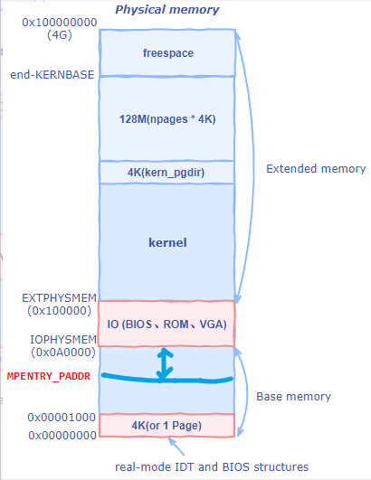
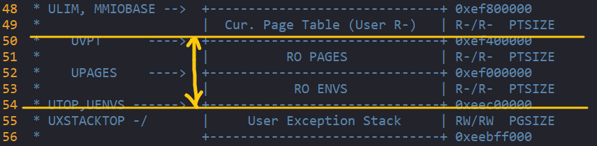

# 目录
<!-- vim-markdown-toc GFM -->

* [Lab 4: Preemptive Multitasking](#lab-4-preemptive-multitasking)
    * [Part A: Multiprocessor Support and Cooperative Multitasking](#part-a-multiprocessor-support-and-cooperative-multitasking)
        * [Multiprocessor Support](#multiprocessor-support)
            * [Exercise 1.](#exercise-1)
        * [Application Processor Bootstrap](#application-processor-bootstrap)
            * [Exercise 2.](#exercise-2)
            * [Question](#question)
        * [Per-CPU State and Initialization](#per-cpu-state-and-initialization)
            * [Exercise 3.](#exercise-3)
            * [Exercise 4.](#exercise-4)
        * [Locking](#locking)
            * [Exercise 5.](#exercise-5)
            * [Question](#question-1)
        * [Round-Robin Scheduling](#round-robin-scheduling)
            * [Exercise 6.](#exercise-6)
            * [Question](#question-2)
        * [System Calls for Environment Creation](#system-calls-for-environment-creation)
            * [Exercise 7.](#exercise-7)
    * [问题](#问题)

<!-- vim-markdown-toc -->
# Lab 4: Preemptive Multitasking

## Part A: Multiprocessor Support and Cooperative Multitasking

该部分会扩展JOS以在多处理器系统上运行，然后实现一些新的JOS内核系统调用，以允许用户级环境创建额外的新环境。然后实现协作循环调度，在当前环境自愿放弃CPU(或退出)时，允许内核从一个环境切换到另一个环境。在part C，将实现抢占式调度，该调度使内核可以在经过一定时间后从环境重新获得对CPU的控制，即使环境不自愿也会强制调度。

### Multiprocessor Support

我们将使JOS支持“symmetric multiprocessing”（SMP），一种多处理器模型，其中所有CPU都具有对系统资源（例如内存和I / O总线）的同等访问权限。虽然SMP中的所有cpu在功能上是相同的，但在引导过程中它们可以分为两种类型:the bootstrap processor(BSP)负责初始化系统和引导操作系统，然后在操作系统启动并运行后，BSP才会激活the application processors（APs）。哪个处理器是BSP是由硬件和BIOS决定的。到目前为止，您现有的所有JOS代码都在BSP上运行。

在SMP系统中，每个CPU都有一个附随的本地APIC（LAPIC）单元。 LAPIC单元负责在整个系统中传递中断。LAPIC还为其连接的CPU提供唯一标识符。在本实验中，我们利用LAPIC单元的以下基本功能（在kern / lapic.c中）：  

* 读取LAPIC标识符（APIC ID）以了解我们的代码当前在哪个CPU上运行（请参阅cpunum（））。
* Sending the STARTUP interprocessor interrupt (IPI) from the BSP to the APs to bring up other CPUs (see lapic_startap()).  
* 在C部分中，我们对LAPIC的内置计时器进行编程，以触发时钟中断以支持抢先式多任务处理（请参阅apic_init（））。

处理器使用memory-mapped I/O (MMIO)来访问LAPIC，MMIO就是物理内存上的一段专门用来访问设备的一块内存，前面实验也有提到，在物理内存的0xA0000上有个IO区域。而LAPIC位于一个从物理地址0xFE000000（比4GB短32MB）开始的孔中，JOS虚拟内存将其映射到MMIOBASE上，区域大小为4M。后面的实验会引入更多的MMIO区域。

#### Exercise 1.

> Implement `mmio_map_region` in kern/pmap.c. To see how this is used, look at the beginning of `lapic_init` in `kern/lapic.c`. You'll have to do the next exercise, too, before the tests for `mmio_map_region` will run.

mmio_map_region()作用就是把传入的物理区域映射到MMIOBASE。  还要继续做第二个exercise才能成功运行mmio_map_region()。

```c
void *
mmio_map_region(physaddr_t pa, size_t size)
{
    static uintptr_t base = MMIOBASE;

    void *ret = (void *)base;
    size_t round_size = ROUNDUP(size, PGSIZE);
    if(round_size+base >= MMIOLIM) panic("mmio_map_region overflow!");

    boot_map_region(kern_pgdir, base, round_size, pa, PTE_W|PTE_PCD|PTE_PWT);
    base += round_size;
    //panic("mmio_map_region not implemented");
    return (void *)ret;
}
```

### Application Processor Bootstrap

在启动AP之前，BSP会先收集有关多处理器系统的信息，例如CPU的总数，它们的APIC ID和LAPIC单元的MMIO地址。kern/mpconfig.c中的mp_init（）函数通过读取驻留在BIOS内存区域中的MP配置表来检索此信息。  

boot_aps（）函数（在kern / init.c中）驱动AP引导过程。 AP在实模式下启动，就像引导加载程序在boot / boot.S中启动的方式一样，因此boot_aps（）将AP入口代码（kern / mpentry.S）复制到可在实模式下寻址的内存位置。 与引导加载程序不同，我们可以控制AP从何处开始执行代码。 我们将输入代码复制到0x7000（MPENTRY_PADDR），但是小于640KB(0xA0000)的任何未使用的，与页面对齐的物理地址都可以使用。

之后，boot_aps（）通过向相应AP的LAPIC单元(Advanced Programmable Interrupt Controller)发送STARTUP IPI以及一个初始CS：IP地址（该示例中为AP开始运行该AP的起始CS：IP地址）来依次激活AP。 kern / mpentry.S中的输入代码与boot / boot.S的输入代码非常相似。 进行一些简短的设置后，它将使AP进入启用分页的保护模式，然后调用C程序mp_main（）（也在kern / init.c中）。 boot_aps（）等待AP在其struct CpuInfo的cpu_status字段中发信号通知CPU_STARTED标志，然后再继续唤醒下一个。

#### Exercise 2.

> Read boot_aps() and mp_main() in kern/init.c, and the assembly code in kern/mpentry.S. Make sure you understand the control flow transfer during the bootstrap of APs. Then modify your implementation of page_init() in kern/pmap.c to avoid adding the page at MPENTRY_PADDR to the free list, so that we can safely copy and run AP bootstrap code at that physical address. Your code should pass the updated check_page_free_list() test (but might fail the updated check_kern_pgdir() test, which we will fix soon).

要做的事情就是修改lab 2中base memory中的页面映射情况，需要把MPENTRY_PADDR到base memory结尾处的地址引用数设为1。



```c
void
page_init(void)
{
    size_t i;
    page_free_list = NULL;
    //num_iohole：在IO hole区域占用的页数. (0x100000-0xA0000)/4K=96
    int num_iohole = (EXTPHYSMEM-IOPHYSMEM)/PGSIZE;
    //num_alloc：在extended memory区域已经被占用的页数
    int num_extalloc = ((uint32_t)boot_alloc(0)-KERNBASE)/PGSIZE;
    int num_mpentry = MPENTRY_PADDR/PGSIZE;
    //cprintf("pageinfo size: %d\n", sizeof(struct PageInfo));
    //cprintf("npages_basemem = %d, num_iohol = %d,num_extalloc=%d\n",npages_basemem, num_iohole, num_extalloc);
    // MPENTRY_PADDR
    for(i=0; i<npages; i++) {
        if(i==0 || i == num_mpentry) {
            pages[i].pp_ref = 1;
        } else if(i >= npages_basemem && i < npages_basemem + num_iohole + num_extalloc) {
            pages[i].pp_ref = 1;
        } else {
            pages[i].pp_ref = 0;
            pages[i].pp_link = page_free_list;
            page_free_list = &pages[i];
        }
    }
}
```

至此，通过check_page_free_list()，执行结果：

```c
check_page_free_list() succeeded!
check_page_alloc() succeeded!
check_page() succeeded!
kernel panic on CPU 0 at kern/pmap.c:871: assertion failed: check_va2pa(pgdir, base + KSTKGAP + i) == PADDR(percpu_kstacks[n]) + i
```

#### Question

> Compare kern/mpentry.S side by side with boot/boot.S. Bearing in mind that kern/mpentry.S is compiled and linked to run above KERNBASE just like everything else in the kernel, what is the purpose of macro MPBOOTPHYS? Why is it necessary in kern/mpentry.S but not in boot/boot.S? In other words, what could go wrong if it were omitted in kern/mpentry.S?
> Hint: recall the differences between the link address and the load address that we have discussed in Lab 1.

因为AP此时处于保护模式，mpentry_start位于kernbase之上，而加载的
因为BSP运行mpentry.S时为保护模式，所有地址都是在kernbase之上。而AP启动时是以实模式运行，所以需要把地址转为实模式下的地址。  
而boot.S不用转是因为一开始就把代码加载到实模式下可寻址的位置。

### Per-CPU State and Initialization

编写多处理器OS时，区分每个处理器专用的每个CPU状态和整个系统共享的全局状态非常重要。 kern / cpu.h定义了大多数每CPU状态，包括存储每CPU变量的struct CpuInfo结构。 cpunum（）始终返回调用它的CPU的ID，该ID可用作cpus之类的数组的索引。 另外，宏thiscpu是当前CPU的结构CpuInfo的简写。

下面是您应该知道的每cpu状态：

* cpu内核堆栈  
  因为多个cpu可能同时陷入内核，所以我们需要为每个处理器提供一个单独的内核堆栈，以防止它们相互干扰对方的执行。数组percpu_kstacks[NCPU][KSTKSIZE]为NCPU的内核堆栈保留空间。

在实验2中，您映射了引导堆栈称为KSTACKTOP下方的BSP内核堆栈的物理内存。 同样，在本实验中，您将把每个CPU的内核堆栈映射到该区域，其中保护页充当它们之间的缓冲区。 CPU 0的堆栈仍将从KSTACKTOP增长； CPU 1的堆栈将从CPU 0的堆栈底部开始的KSTKGAP字节开始，依此类推。 inc / memlayout.h显示了映射布局。

* 每个CPU的TSS 和 TSS描述符。  
  还需要每个CPU的任务状态段（TSS），以指定每个CPU的内核堆栈所在的位置。 CPU i的TSS存储在cpus[i] .cpu_ts中，并且相应的TSS描述符在GDT条目gdt [（GD_TSS0 >> 3）+ i]中定义。 在kern / trap.c中定义的全局ts变量将不再有用。

* 每个CPU当前环境指针。  
  由于每个CPU可以同时运行不同的用户进程，所以我们重新定义了符号curenv来表示cpu [cpunum()].cpu_env(或thiscpu->cpu env)，它指向当前cpu上执行的环境(运行代码的cpu)。

* 每个cpu的系统寄存器。  
  所有寄存器，包括系统寄存器，都是CPU专用的。 因此，初始化这些寄存器的指令，例如lcr3（），ltr（），lgdt（），lidt（）等，必须在每个CPU上执行一次。 为此，定义了函数env_init_percpu（）和trap_init_percpu（）。

#### Exercise 3.

> Modify mem_init_mp() (in kern/pmap.c) to map per-CPU stacks starting at KSTACKTOP, as shown in inc/memlayout.h. The size of each stack is KSTKSIZE bytes plus KSTKGAP bytes of unmapped guard pages. Your code should pass the new check in check_kern_pgdir().

映射每个CPU的栈空间，一个栈有两部分组成，一部分是正常使用的栈KSTSIZE，一部分是未映射的，防止一个CPU的栈空间增长导致另一个CPU栈空间被覆盖，起到保护作用。  

```c
static void
mem_init_mp(void)
{
    // LAB 4: Your code here:
    for (size_t i = 0; i < NCPU; i++){
        uint32_t kstacktop_i = KSTACKTOP - i * (KSTKSIZE + KSTKGAP);
        boot_map_region(kern_pgdir, kstacktop_i-KSTKSIZE, KSTKSIZE, PADDR(&percpu_kstacks[i]), PTE_W | PTE_P | PTE_U);
    }
}
```

至此，check_kern_pgdir()也通过了，运行结果：  

```c
check_page_free_list() succeeded!
check_page_alloc() succeeded!
check_page() succeeded!
check_kern_pgdir() succeeded!
check_page_free_list() succeeded!
check_page_installed_pgdir() succeeded!
SMP: CPU 0 found 1 CPU(s)
enabled interrupts: 1 2
[00000000] new env 00001000
kernel panic on CPU 0 at kern/trap.c:362: kernel-mode page fault at error 0
```

#### Exercise 4.

> The code in trap_init_percpu() (kern/trap.c) initializes the TSS and TSS descriptor for the BSP. It worked in Lab 3, but is incorrect when running on other CPUs. Change the code so that it can work on all CPUs. (Note: your new code should not use the global ts variable any more.)

初始化所有CPU的TSS段。这里的GD_TSS0代表 Task segment selector，但是没找到它的结构，不清楚操作了哪些东西

```c
void
trap_init_percpu(void)
{
    // Setup a TSS so that we get the right stack
    // when we trap to the kernel.
    size_t i = cpunum();
    //   - The macro "thiscpu" always refers to the current CPU's
    //     struct CpuInfo;
    thiscpu->cpu_ts.ts_esp0 = KSTACKTOP- i * (KSTKSIZE + KSTKGAP);
    thiscpu->cpu_ts.ts_ss0 = GD_KD;
    //   - Initialize cpu_ts.ts_iomb to prevent unauthorized environments
    //     from doing IO (0 is not the correct value!)
    thiscpu->cpu_ts.ts_iomb = sizeof(struct Taskstate);

    // Initialize the TSS slot of the gdt.
    //   - Use gdt[(GD_TSS0 >> 3) + i] for CPU i's TSS descriptor;
    gdt[(GD_TSS0 >> 3) + i] = SEG16(STS_T32A, (uint32_t) (&thiscpu->cpu_ts),
                    sizeof(struct Taskstate) - 1, 0);
    gdt[(GD_TSS0 >> 3) + i].sd_s = 0;

    // Load the TSS selector (like other segment selectors, the
    // bottom three bits are special; we leave them 0)
    //???why
    ltr(GD_TSS0 + (i<<3));

    // Load the IDT
    lidt(&idt_pd);
}
```

执行`make qemu-nox CPUS=4`后，运行结果：  

```c
Physical memory: 131072K available, base = 640K, extended = 130432K
i386_detect_memory():
npages:32768, npages_basemem = 160
check_page_free_list() succeeded!
check_page_alloc() succeeded!
check_page() succeeded!
check_kern_pgdir() succeeded!
check_page_free_list() succeeded!
check_page_installed_pgdir() succeeded!
SMP: CPU 0 found 4 CPU(s)
enabled interrupts: 1 2
SMP: CPU 1 starting
SMP: CPU 2 starting
SMP: CPU 3 starting
[00000000] new env 00001000
kernel panic on CPU 0 at kern/trap.c:362: kernel-mode page fault at error 0
```

### Locking

在mp_main（）中初始化AP之后，代码自旋，不往下运行。在让AP往下运行之前，我们需要首先解决多个CPU同时运行内核代码时的竞争条件。 实现此目的的最简单方法是使用大内核锁。 大内核锁是单个全局锁，每当环境进入内核模式时都会被持有，并在环境返回到用户模式时释放。 在此模型中，用户模式下的环境可以在任何可用的CPU上同时运行，但是内核模式下只能运行一个环境。 任何其他尝试进入内核模式的环境都必须等待。

kern / spinlock.h声明了大的内核锁，即kernel_lock。 它还提供lock_kernel（）和unlock_kernel（），这是获取和释放锁的快捷方式。 您应该在四个位置应用大内核锁：  

* 在i386_init（）中，在BSP唤醒其他CPU之前获取锁。
* 在mp_main（）中，在初始化AP之后获取锁，然后调用sched_yield（）开始在此AP上运行环境。
* 在trap（）中，从用户模式捕获时获取锁定。 要确定陷阱是在用户模式下还是内核模式下发生的，请检查tf_cs的低位。
* 在env_run（）中，在切换到用户模式之前立即释放锁定。 不要太前也不要太后，否则会遇到冲突或死锁。

#### Exercise 5.

> Apply the big kernel lock as described above, by calling lock_kernel() and unlock_kernel() at the proper locations.  

i386_init(): ./kern/init.c， 启动AP前：

```c
    // Acquire the big kernel lock before waking up APs
    // Your code here:
    lock_kernel();

    // Starting non-boot CPUs
    boot_aps();
```

mp_main():./kern/init.c， 初始化AP后：  

```c
    ...
    ...
    lock_kernel();

    // Now that we have finished some basic setup, call sched_yield()
    // to start running processes on this CPU.  But make sure that
    // only one CPU can enter the scheduler at a time!
    //
    // Your code here:
    sched_yield();

    // Remove this after you finish Exercise 6
    //for (;;);
}
```

trap(): kern/trap.c， 从用户模式陷入前：  

```c
        // Trapped from user mode.
        // Acquire the big kernel lock before doing any
        // serious kernel work.
        // LAB 4: Your code here.
        lock_kernel();
        assert(curenv);
```

env_run(): kern/env.c:， 切换到用户模式前：  

```c
    ...
    ...
    lcr3(PADDR(curenv->env_pgdir));
    unlock_kernel();

    env_pop_tf(&curenv->env_tf);

    //panic("env_run not yet implemented");
}
```

#### Question

> It seems that using the big kernel lock guarantees that only one CPU can run the kernel code at a time. Why do we still need separate kernel stacks for each CPU? Describe a scenario in which using a shared kernel stack will go wrong, even with the protection of the big kernel lock.

因为在陷入之前，要保存SS, ESP, EFLAGS, CS, EIP到TSS，若多个CPU都同时压到一个TSS内，结构就乱套了。这些都发生于CPU加锁前。

### Round-Robin Scheduling

本实验中的下一个任务是更改JOS内核，以便它可以“循环”方式在多个环境之间交替。 JOS中的循环调度工作方式如下：  

* 新的kern / sched.c中的函数sched_yield（）负责选择要运行的新环境。 它以循环方式依次搜索envs []数组，从先前运行的环境之后开始（如果没有先前运行的环境，则从数组的开始开始），选择状态为ENV_RUNNABLE的第一个环境（请参见 inc / env.h），然后调用env_run（）转入该环境。
* sched_yield（）绝对不能在两个CPU上同时运行相同的环境。 它可以判断某个环境当前正在某些CPU（可能是当前CPU）上运行，因为该环境的状态为ENV_RUNNING。
* 我们为您实现了一个新的系统调用sys yield()，用户环境可以调用它来调用内核的sched yield()函数，从而让其自愿将CPU让给另一个环境。

#### Exercise 6.

> Implement round-robin scheduling in sched_yield() as described above. Don't forget to modify syscall() to dispatch sys_yield().
> 
> Make sure to invoke sched_yield() in mp_main.
> 
> Modify kern/init.c to create three (or more!) environments that all run the program user/yield.c.
> 
> Run make qemu. You should see the environments switch back and forth between each other five times before terminating, like below.
> Test also with several CPUS: make qemu CPUS=2.
> 
> ...
> Hello, I am environment 00001000.
> Hello, I am environment 00001001.
> Hello, I am environment 00001002.
> Back in environment 00001000, iteration 0.
> Back in environment 00001001, iteration 0.
> Back in environment 00001002, iteration 0.
> Back in environment 00001000, iteration 1.
> Back in environment 00001001, iteration 1.
> Back in environment 00001002, iteration 1.
> ...
> After the yield programs exit, there will be no runnable environment in the system, the scheduler should invoke the JOS kernel monitor. If any of this does not happen, then fix your code before proceeding.

实现轮询调度，从当前环境的下一个环境开始遍历，寻找状态为RUNNABLE的环境并运行。  
kern/sched.c:  

```c
void
sched_yield(void)
{
    struct Env *idle;
    idle = curenv;

    int id_beg = 0;
    if(curenv) id_beg = ENVX(curenv->env_id)+1;

    for (int i = 0; i < NENV; i++) {
        int j = (id_beg + i) % NENV;
        if (envs[j].env_status == ENV_RUNNABLE) {
            idle = &envs[j];
            //env_run(&envs[j]);
            break;
        }
    }

    // Search through 'envs' for an ENV_RUNNABLE environment in
    // circular fashion starting just after the env this CPU was
    // last running.  Switch to the first such environment found.
    //
    // If no envs are runnable, but the environment previously
    // running on this CPU is still ENV_RUNNING, it's okay to
    // choose that environment.
    if (idle && (idle->env_status == ENV_RUNNING || idle->env_status == ENV_RUNNABLE)) {
        env_run(idle);
    }
    // sched_halt never returns
    sched_halt();
}
```

添加系统调用：  
kern/syscall.c:  

```c
int32_t
syscall(uint32_t syscallno, uint32_t a1, uint32_t a2, uint32_t a3, uint32_t a4, uint32_t a5)
{
    case SYS_yield:
        sys_yield();
        return 0;
        ...
```

创建三个环境，运行同一个程序:
kern/init.c:  

```c
void
i386_init(void)
{
    // Touch all you want.
    //ENV_CREATE(user_primes, ENV_TYPE_USER);
    ENV_CREATE(user_yield, ENV_TYPE_USER);
    ENV_CREATE(user_yield, ENV_TYPE_USER);
    ENV_CREATE(user_yield, ENV_TYPE_USER);
    ...
    ...
```

执行`make qemu-nox CPUS=2`后，运行结果，可以看到：  

```c
SMP: CPU 0 found 2 CPU(s)
enabled interrupts: 1 2
SMP: CPU 1 starting
[00000000] new env 00001000
[00000000] new env 00001001
[00000000] new env 00001002
Hello, I am environment 00001000.
Hello, I am environment 00001001.
Back in environment 00001000, iteration 0.
Hello, I am environment 00001002.
Back in environment 00001001, iteration 0.
Back in environment 00001000, iteration 1.
Back in environment 00001002, iteration 0.
Back in environment 00001001, iteration 1.
Back in environment 00001000, iteration 2.
Back in environment 00001002, iteration 1.
Back in environment 00001001, iteration 2.
Back in environment 00001000, iteration 3.
Back in environment 00001002, iteration 2.
Back in environment 00001001, iteration 3.
Back in environment 00001000, iteration 4.
Back in environment 00001002, iteration 3.
All done in environment 00001000.
[00001000] exiting gracefully
[00001000] free env 00001000
Back in environment 00001001, iteration 4.
Back in environment 00001002, iteration 4.
All done in environment 00001001.
All done in environment 00001002.
[00001001] exiting gracefully
[00001001] free env 00001001
[00001002] exiting gracefully
[00001002] free env 00001002
No runnable environments in the system!
```

#### Question

> In your implementation of env_run() you should have called lcr3(). Before and after the call to lcr3(), your code makes references (at least it should) to the variable e, the argument to env_run. Upon loading the %cr3 register, the addressing context used by the MMU is instantly changed. But a virtual address (namely e) has meaning relative to a given address context--the address context specifies the physical address to which the virtual address maps. Why can the pointer e be dereferenced both before and after the addressing switch?

问的是env_run()内lcr3切换了环境的页目录，为什么之前定义的环境Env *e还能继续正常地解引用？因为lab3中有提到，UTOP以上，环境的页目录和内核的页目录是一样的，自然所有环境UTOP以上也是一样的。



> Whenever the kernel switches from one environment to another, it must ensure the old environment's registers are saved so they can be restored properly later. Why? Where does this happen?

切换环境时要保存，不然恢复的时候不知道下一条语句在哪。通过trap()中的curenv->env_tf = *tf保存寄存器状态。

### System Calls for Environment Creation

尽管内核现在能够在多个用户级环境之间运行和切换，但它仍然局限于运行内核最初设置的环境。现在您将实现必要的JOS系统调用，以允许用户环境创建和启动其他新用户环境。

Unix提供fork()系统调用作为它的进程创建原语。Unix fork()复制调用进程(父进程)的整个地址空间，以创建一个新进程(子进程)。从用户空间可以观察到的两个进程之间的唯一区别是它们的进程id和父进程id(由getpid和getppid返回)。在父进程中，fork()返回子进程的ID，而在子进程中，fork()返回0。默认情况下，每个进程都有自己的私有地址空间，而且任何进程对内存的修改对其他进程都不可见。

您将提供一组不同的、更基本的JOS系统调用来创建新的用户模式环境。除了其他类型的环境创建之外，通过这些系统调用，您将能够完全在用户空间中实现类unix fork()。您将为JOS编写的新系统调用如下：

`sys_exofork`:  
这个系统调用创建了一个几乎是空白的新环境:它的地址空间的用户部分没有映射任何东西，而且它是不可运行的。在sys_exofork调用时，新环境将具有与父环境相同的注册状态。在父程序中，sys_exofork将返回新创建环境的envid_t(如果环境分配失败，则返回负错误代码)。但是在子进程中，它将返回0。(因为子进程一开始被标记为not runnable，所以sys_exofork实际上不会返回到子进程中，直到父进程通过使用…显式地将子进程标记为runnable才会返回)

`sys_env_set_status`:
将指定环境的状态设置为ENV_RUNNABLE或ENV_NOT_RUNNABLE。这个系统调用通常用于在地址空间和寄存器状态完全初始化之后标记一个准备运行的新环境。

`sys_page_alloc`:  
分配一页物理内存，并将其映射到给定环境的地址空间中的给定虚拟地址。

`sys_page_unmap`:  
取消映射到给定环境中给定虚拟地址的页面。

对于上述接受环境id的所有系统调用，JOS内核支持这样的约定:值0表示“当前环境”。这个约定由kern/env.c中的envid2env()实现。

我们在测试程序user/dumbfork.c中提供了类unix fork()的非常原始的实现。这个测试程序使用上面的系统调用来创建并运行一个带有自己地址空间副本的子环境。然后，这两个环境使用sys_yield来回切换，就像前面练习中那样。父进程在10次迭代后退出，而子进程在20次迭代后退出。

#### Exercise 7.

> Implement the system calls described above in kern/syscall.c and make sure syscall() calls them. You will need to use various functions in kern/pmap.c and kern/env.c, particularly envid2env(). For now, whenever you call envid2env(), pass 1 in the checkperm parameter. Be sure you check for any invalid system call arguments, returning -E_INVAL in that case. Test your JOS kernel with user/dumbfork and make sure it works before proceeding.

## 问题

* exercise 4里的segment selector为什么要加一个数，不是说要设为0吗
* 
